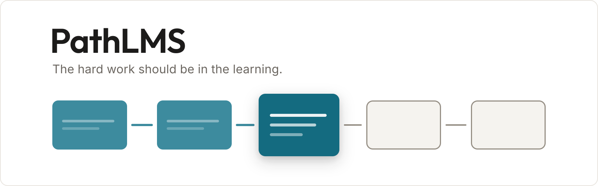
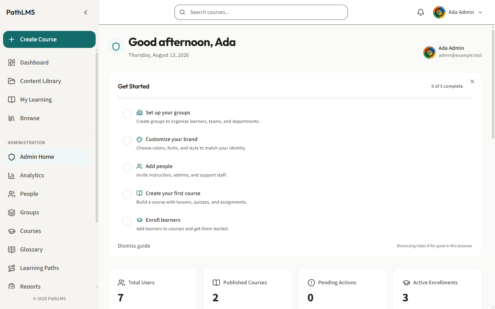
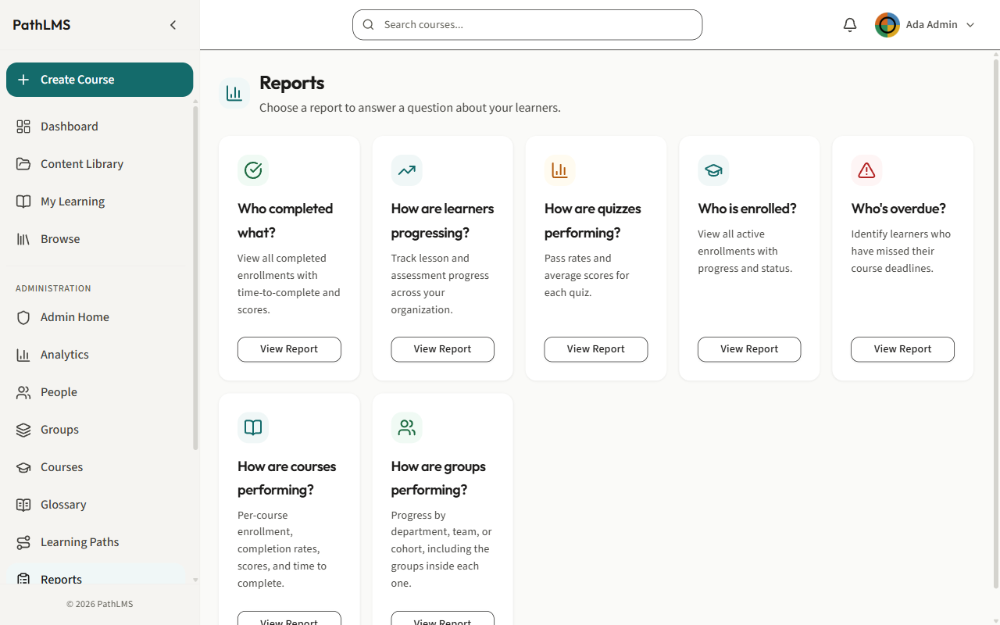
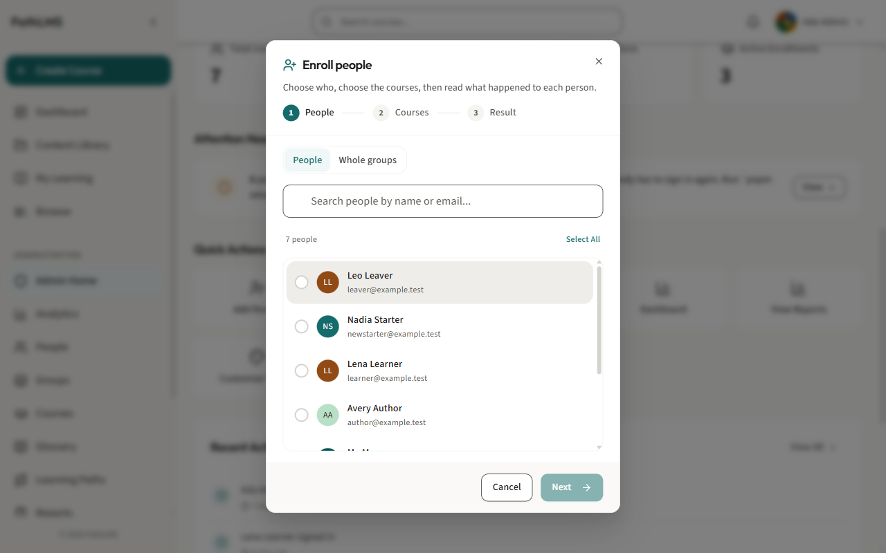
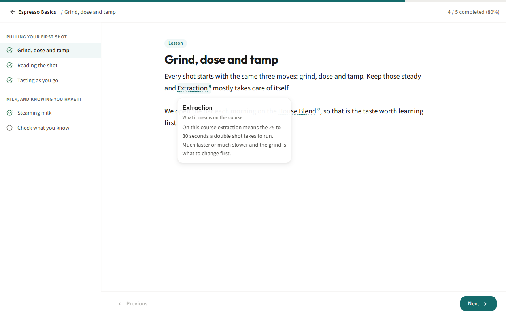

# PathLMS

PathLMS is built around a deliberately simple idea: an environment for learning
should be easy to create, easy to organize, easy to understand, and easy to take
care of.

A learning path is a sequence of courses. Courses contain modules, sections,
lessons, and quizzes. That is the model. There are no extra layers to learn, no
complicated structures to maintain, and no need to reshape your training around
the LMS.

<!-- version -->
**Version 0.95.0** · [Releases](https://github.com/path-lms/pathlms/releases)
<!-- /version -->

Courses can be completely open, carefully sequenced, or anything in between. If
a lesson depends on something else, PathLMS simply tells the learner what they
need to complete first. Structure is there when it is useful and stays out of
the way when it is not.

The same philosophy applies to how PathLMS looks. Organizations can make it feel
like their own without having to become designers. Choose your brand color and
PathLMS takes care of the surrounding visual system: keeping typography,
spacing, contrast, motion, and accessibility consistent.

The result is an LMS that is unusually easy to live with. It gives authors
enough structure to create clear learning experiences, gives organizations
enough flexibility to make those experiences their own, and gives learners an
interface that remains understandable from the moment they arrive.

PathLMS can also run wherever an organization is most comfortable running it,
without making that deployment model part of the learning experience.

Simple where learning should be simple. Flexible where organizations need
flexibility. Consistent everywhere else.

**[Download the latest release →](https://github.com/path-lms/pathlms/releases/latest)**

---

## What it does

- **Write a course.** Type it in a browser, arrange it into modules and lessons,
  publish it when it is ready. Your work is saved as you write it, and moving to
  another lesson saves the one you were on first, so clicking away cannot lose a
  paragraph.
- **Put courses in order.** A learning path is several courses in a sequence, and
  somebody joins the whole sequence once rather than a course at a time.
- **Ask questions.** Quizzes are marked for you, and the score is kept with the
  rest of that person's record.
- **Give somebody proof they finished.** On courses where you switch it on, a
  learner can open and print a certificate from their own record. A deployment
  that has given itself a name issues a certificate of completion and says who
  issued it. One that has not issues a record of completion and says so plainly,
  rather than leaving a blank where a name should be.
- **Group people the way your organization already works.** Groups sit inside
  other groups. Give a group a folder of courses and everyone in that group has
  them, so nobody is enrolled one person at a time.
- **Enroll a group in one pass.** Pick people or a whole group, pick the courses,
  done. Then it names anybody it could not enroll, and why.
- **Get the answer you were asked for.** Reports are the questions people
  actually ask, not a query builder. Pick one, narrow it, export it. The export
  asks first whether the file should carry people's names, and the answer is no
  until you change it.
- **Find out who changed something.** Significant actions are written down in a
  record the application itself cannot edit or delete, each entry linked to the
  one before, so a gap in it shows.
- **Erase somebody when they ask.** Do it from the People screen, and it tells
  you what went and what was kept.
- **Look like your organization.** Set one brand color and upload a logo. Nobody
  has to be a designer, and nobody has to go back and check dark mode, because
  dark is designed rather than inverted.

## PathLMS in action

*The first screen after setup. Five steps, and you can ignore all five: nothing
behind them is locked and no wizard decides what you do first. Your own first
screen is emptier than this one, which has the optional example data loaded.*

*Reports are questions. Pick the one you were asked, narrow the answer, export
it. The export asks first whether the file should carry people's names.*

*Pick people or a whole group, pick the courses, done. Then it names anybody it
could not enroll and why, with a link straight to that person.*

*The same word means different things to different groups of people, so a reader
gets the meaning that fits what they are reading. Where nobody has written one,
the word is left plain, because showing somebody the wrong meaning is worse than
showing none.*

*These are screenshots of the software running.*

## Who it is for

PathLMS is for organizations that need learning management to be
straightforward.

It works especially well when the goal is simple: provide training, see who has
completed it, follow up with those who have not, and produce a clear record when
someone asks for it.

It is designed for recurring learning as much as one-time training, so
onboarding new people, repeating required courses, and keeping completion
records up to date does not become a separate administrative exercise.

PathLMS also suits organizations that prefer to run their own software and keep
control of their own environment. There are no per-user fees or license costs,
so access does not have to be rationed according to headcount.

The result is an LMS that stays practical as the organization grows: easy to
operate, easy to understand, and available to everyone who needs it.

## What it does not do

PathLMS is intentionally focused. A few limits are worth knowing up front.

**No recurring training yet.** Completed courses stay complete. PathLMS does not
currently reset, expire, or automatically reassign training.

**No assignment submissions.** Assignments can contain instructions, but learners
cannot submit work against them.

**Imported course packages do not run on a release installation yet.** Support
for content from tools such as Articulate or Captivate is built and switched off
by default, and the one web server rule it needs is not in the compose file a
release ships. No setting inside the product can conjure that rule, so such a
deployment serves nothing whatever the switch says.

**Quiz reporting is incomplete.** Quiz data is recorded, but the dedicated
quiz-performance report is not yet available.

**No built-in two-step authentication.** PathLMS can instead use your existing
identity provider.

**Single-instance deployment.** PathLMS is designed to run as one application
instance, not as a clustered service.

**HTTPS is configured during deployment.** Use your existing reverse proxy or let
PathLMS handle the certificate directly.

**Updates are administrator-controlled.** PathLMS checks, backs up, and prepares
the update, but never replaces its own running containers.

**Accessibility is a target, not a certification claim.** Contrast, a focus
outline you can see, a name on every control and a tap target big enough for a
finger are checked in a real browser before every change is accepted, and a
failure stops the build. Nobody has sat down with a screen reader and no outside
expert has reviewed it, so WCAG 2.2 AA is the target rather than a claim.

**Very little leaves the installation.** Learner data stays local. PathLMS only
checks breached passwords and available software versions, and the version check
can be disabled.

**Keep a second administrator account.** If the only administrator forgets their
password without email recovery configured, recovery means somebody writing a new
one straight into the database. The lockout that follows failed sign-in attempts
is not this: it clears itself.

These are the current boundaries of PathLMS, not features reserved for another
edition.

## What you need

- A machine running **Docker** and the **Docker Compose plugin**. That is the
  only requirement. There is no source code to download, no `git`, no Node.js and
  no build step on the server.
- **Two processor cores and 4 GB of memory** is a comfortable starting point for
  a small organization. The application container is capped at 2 cores and 512 MB
  and the object store at 1 core and 512 MB by the stack itself. The database is
  not capped and will use what it needs.
- **Room for your uploads and your backups.** You choose two directories, one for
  the data and one for the backups, so you can put the backups on a different
  disk.
- Images are published for **Intel and ARM**, so a Graviton, Ampere or Apple
  silicon host works the same as an x86 one.

## Install

About fifteen minutes, most of which is the machine downloading things. The full
walkthrough for every environment is in **[Deploying PathLMS](DEPLOYMENT.md)**.
The short version:

1. Download the files attached to the [latest
   release](https://github.com/path-lms/pathlms/releases/latest) into an empty
   directory on your server.
2. Follow `INSTALL.md`, which came with them. One command generates every
   password and key, inside the image you are about to run, so nothing has to be
   invented or pasted from anywhere. Three things are yours to decide: the
   address people will type, your email address, and a password you choose.
3. Start it, open your address, and sign in.

### What a release contains

| File | What it is |
| --- | --- |
| `docker-compose.yml` | The whole stack. Do not edit it. |
| `pathlms.env` | Every setting you must supply, with this release's image addresses already filled in and everything else deliberately empty. |
| `INSTALL.md` | Numbered steps from an empty directory to a signed-in administrator. |
| `CHANGING-THE-PORT.md` | Keep it beside the others. It is how you move the port later, and its recovery section is written to be read on the day PathLMS is not answering. |

A release also attaches one short page for each environment that decides
something its own way, so you can read it without leaving the download.

The images a release publishes are each pinned to an exact cryptographic
fingerprint rather than to a tag. A tag can be moved to point at different bytes
after you have read it. A fingerprint cannot, so two installations of one version
are running the same software and can be shown to be.

**A fresh installation contains nothing.** No sample company, no demo accounts,
no branding but your own. It creates exactly one account, from the email address
and password you choose, and only while there are no accounts at all.

## After it starts

[What to do once it is running](AFTER-IT-STARTS.md) covers the first
administrator, telling PathLMS its own address, and deciding what happens about
encryption.

## Updates

[How updates work](UPDATES.md). A release page, three image addresses, and a
section inside the product that checks, backs up, and records what it did.

## Backups

Backups run on their own from the moment you start it, so nobody has to remember
to arrange one. The database and the uploaded files are copied once a day by
default, kept for fourteen days, into a directory you choose, which is
deliberately a separate setting from the data directory so you can point it at a
different disk. The first one runs immediately rather than after a day, so you
find out on day one if the directory is not writable.

**A backup is only a backup once you have restored one somewhere.** Try it before
you need it. [After it starts](AFTER-IT-STARTS.md) has the commands.

## Under the hood

| Part | What it is |
| --- | --- |
| Application | Node.js 24 and TypeScript, serving a GraphQL interface |
| Browser | React 19, built with Vite |
| Web server | nginx, holding the security headers and the rate limits |
| Database | PostgreSQL 18, with row-level security enabled and forced on every table |
| Cache | Valkey 8 |
| Files | An S3-compatible object store, running on your own disk |
| Sign-in | Ed25519 signed tokens, Argon2id password hashing, and the two company sign-in standards, OIDC and SAML |
| Running it | Docker Compose. Seven containers on three networks, two of which cannot reach the internet or be reached from it |

The database itself decides who may read which rows, by a large set of rules the
application checks at every start. If any of them is missing or has been
weakened, it refuses to boot rather than serving somebody else's data quietly.
A learner's lesson progress and quiz attempts can be written by nobody but that
learner or a maintenance task. The enrollment record carrying their completion
adds administrators and managers, because a real screen writes it. Nothing but a
maintenance task can delete any of it.

## License

**No license has been granted yet, so all rights are reserved.**

The intention is to release PathLMS as open source, and that decision has not
been made. Until it is, nobody has permission to fork this, redistribute it, or
build on it. You may install and run it.

If you need software you can fork and pass on, PathLMS is not that yet, and this
page would rather tell you now than after you have built on it.

See [LICENSE.md](LICENSE.md).

## Security

If you find a security problem, please report it privately rather than in a
public issue. [SECURITY.md](SECURITY.md) says how.

## Contributing

See [CONTRIBUTING.md](CONTRIBUTING.md). Bug reports and questions are welcome
now. Code contributions have to wait until the license question above is settled.
