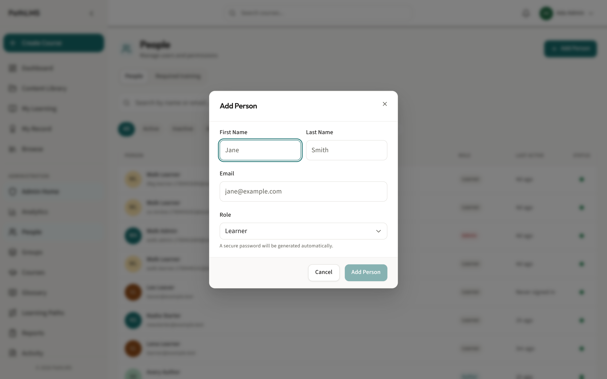
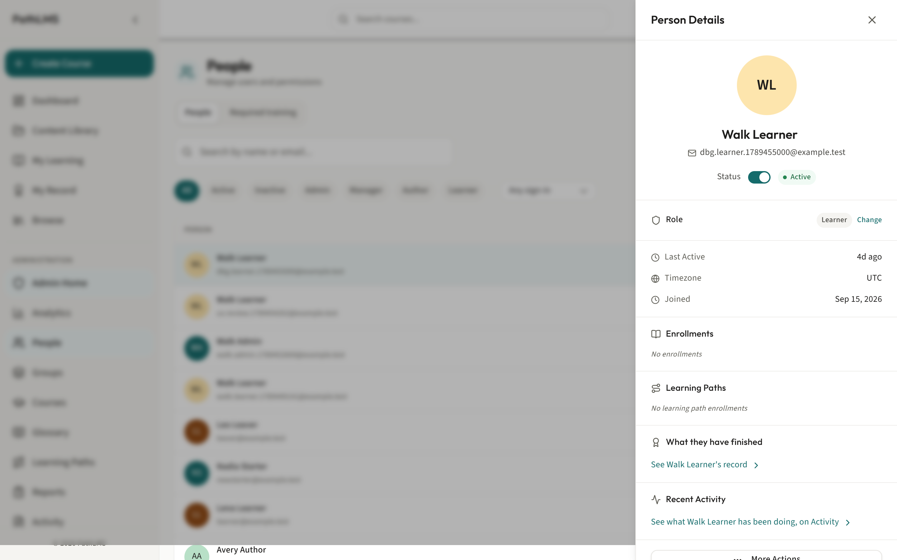
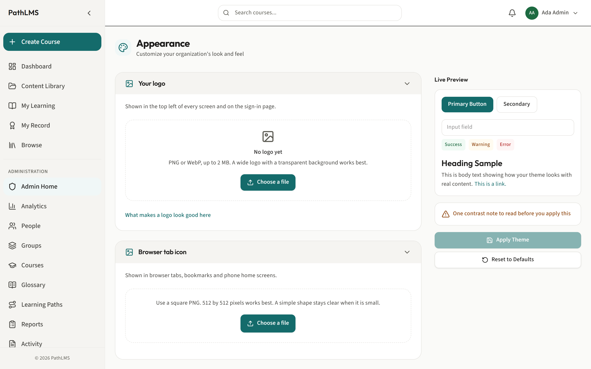
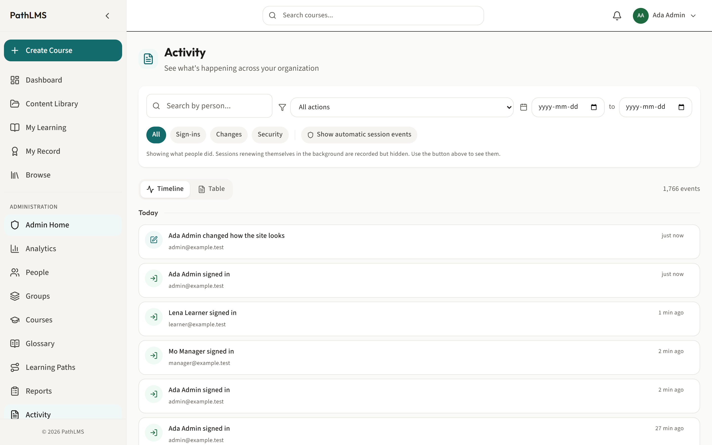
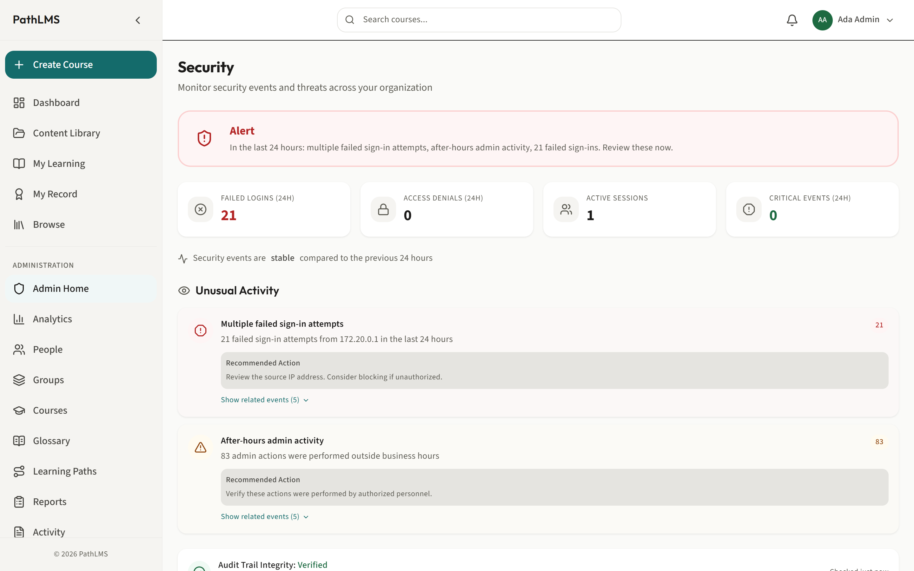
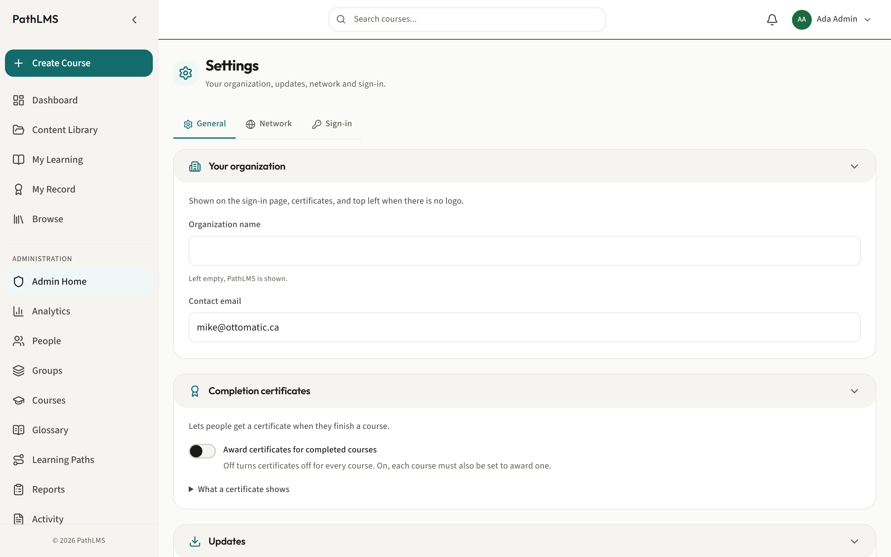

# The administrator guide

This is for an administrator. You can do everything in PathLMS. That
includes everything in the manager guide and the author guide, plus the
parts of the system nobody else can touch: accounts, roles, company
sign-in, branding, and the record of who did what.

With this role you can:

- Create accounts, reset passwords, and change anyone's role.
- Set up company sign-in with your own identity provider.
- Brand the site with your own logo and colors.
- Review the record of important actions, and check nobody has tampered
  with it.
- Manage general settings, network settings, and updates.

## Creating an account

Why: everyone needs an account before they can sign in and be enrolled on
anything. As an administrator, you can create one for any role except
administrator itself.

1. In the sidebar, click **People**.
2. Click **Add Person**.
3. Fill in their first name, last name and email address.
4. Choose a **Role**: Learner, Author, or Manager.
5. Click **Add Person**.

What happens: a password is generated automatically and shown to you once,
so you can pass it on to them. They can sign in straight away.

You will notice Admin is not offered here. There is no "create an
administrator" form. Instead, you make someone an administrator by
changing an existing person's role, covered next.

## Changing someone's role

Why: people move into different responsibilities, and their account
should move with them. This is also how you make a new administrator:
there is no separate form for it, you promote an existing account.

1. On the People screen, click a person's row to open their detail panel.
2. Open the role control and choose the new role.
3. If you choose Manager, you will be asked which group they take charge
   of.
4. Confirm the change.

What happens matters more here than anywhere else on this screen, so read
it carefully.

**Important.** Making someone an administrator, or creating one by promoting
an account, asks you to prove it is really you: your current password, and
the code from your authenticator app. This is not the usual click-and-done.
An administrator can do anything on the whole installation, and that power
outlives the browser session it was granted from, so a plain "are you sure"
is not enough to stop someone else pressing the button on your signed-in
screen. Ordinary account work, like adding a person or turning an account
on, does not ask for anything extra.

If the change is refused, for example because the password was wrong, the
person keeps the role they already had. Nothing changes until the server
agrees.

## Resetting a password

Why: someone has forgotten their password, or you suspect their account
has been compromised, and you need to get them back in safely without
knowing their old password.

1. On the People screen, open the person's detail panel.
2. Choose **Reset Password** from the panel's actions.
3. Prove it is you with your current password.
4. Confirm.

What happens: a new password is generated and shown to you once. Their old
password stops working immediately.

## The five roles

Learner, Author, Manager, Administrator, and Instructor exist as roles in
PathLMS. Instructor is worth calling out on its own: it can be assigned,
but today it works exactly like a learner. There is nothing an instructor
can do that a learner cannot. For the full one-line summary of what each
role is for, see [the note on the roles](README.md#a-note-on-the-roles) in
the guide index.

## The authenticator app, and resetting one for someone

Why: once someone's account can do anything sensitive, a password on its
own is not enough. The authenticator app is a second proof: a code from a
phone app that changes every 30 seconds, set up once and then just used.
As an administrator, you also need to be able to help someone who has
lost their phone and is locked out of that second step.

Setting it up happens once, on the account it belongs to, not on every
sensitive action. It gives that person ten one-time recovery codes at the
same time, for the day their phone is genuinely gone.

1. On the People screen, open the person's detail panel.
2. Choose **Reset authenticator app** from the panel's actions.
3. Prove it is you with your current password.
4. Confirm.

What happens: their old app stops being accepted, and they will be asked
to set up a new one the next time it is needed. Do this only when you are
sure the request is really from them: it is exactly the kind of thing an
attacker holding a stolen password would also ask for.

## Setting up company sign-in

Why: if your organization already has its own identity system, such as
Okta or Azure AD, you can let people sign in with it instead of a PathLMS
password. This is one less password for everyone to remember, and one
less place a leaked password can be used.

1. In the sidebar, click **Settings**.
2. Click the **Sign-in** tab.
3. Add an OIDC or SAML provider, filling in the details your identity
   system gives you.
4. Turn the provider on, and drag it into the order you want it offered
   in, if you have more than one.

What happens: people signing in see the provider you added as an option,
in the order you set. You can turn any provider off again without
deleting it.

## Branding the site

Why: a training platform that looks like your own organization, rather
than a generic product, is easier for people to trust and recognize.

1. In the sidebar, click **Appearance**.
2. Upload your logo.
3. Set your brand color.
4. Set the sign-in background image.
5. Set the browser tab icon.

What happens: these changes apply across the whole site immediately,
including the sign-in screen people see before they have even logged in.

## Reviewing activity, and checking it has not been tampered with

Why: when something goes wrong, or you simply need to know who did what
and when, the Activity screen is the record. Because that record itself
could theoretically be altered by someone with deep access, Security
exists to check that it has not been.

1. In the sidebar, click **Activity** to see the record of important
   actions taken across the system.
2. In the sidebar, click **Security** to verify that record has not been
   tampered with.

What happens: Activity shows you a chronological list you can search and
export. Security tells you plainly whether every entry checks out, or
whether something in the chain has been altered.

Recommendation: if you ever suspect an account has been compromised, check
Security first. It tells you whether you can trust what Activity is about
to show you.

## Settings: General, Network and Sign-in

Why: these three tabs hold the administration that keeps the platform
running, separate from the day-to-day work of managing people and
courses.

1. In the sidebar, click **Settings**.
2. The **General** tab holds your organization's basic details and the
   **Updates** section, where you start a platform update. See
   [UPDATES.md](../UPDATES.md) for the full walkthrough of what an update
   does and the safety checks it runs before anything changes.
3. The **Network** tab holds the address, ports and encryption this
   installation uses. This is deployment territory: see
   [DEPLOYMENT.md](../DEPLOYMENT.md) and
   [BEHIND-A-PROXY.md](../deploy/BEHIND-A-PROXY.md) for what these
   settings mean and how to change them safely.
4. The **Sign-in** tab is covered above, in
   [Setting up company sign-in](#setting-up-company-sign-in).

For branding, which General points to rather than duplicating, see
[Branding the site](#branding-the-site) above.

## Backups

Why: you need to know your training records are safe, and what to do if
you ever need to restore them.

There is no backups screen in PathLMS today, and it is worth saying that
plainly rather than leaving you to hunt for a button that does not exist.
Backups run automatically to a directory on the server. Taking one by
hand, or restoring one, is a command run on the server itself, not a
click in the browser. This is documented for whoever deployed your
installation, since it depends on how and where the server is set up. See
[After it starts](../AFTER-IT-STARTS.md) for the backup and restore steps.

## Related guides

- [Courses, folders and learning paths](courses-folders-and-paths.md), for
  how training itself is built and organized.
- [The manager guide](manager.md), for the day-to-day work of enrolling
  people and reading reports, which you can also do.
- [How updates work](../UPDATES.md), for the full walkthrough of updating
  the platform.
- [Deploying PathLMS](../DEPLOYMENT.md) and
  [Behind a proxy](../deploy/BEHIND-A-PROXY.md), for the deployment and
  network side of Settings.
