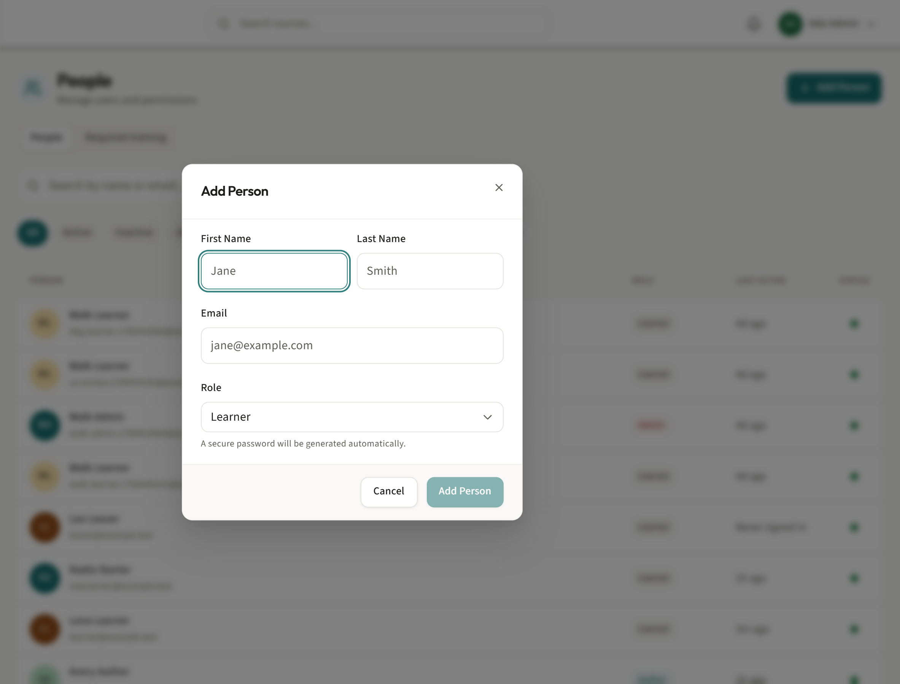
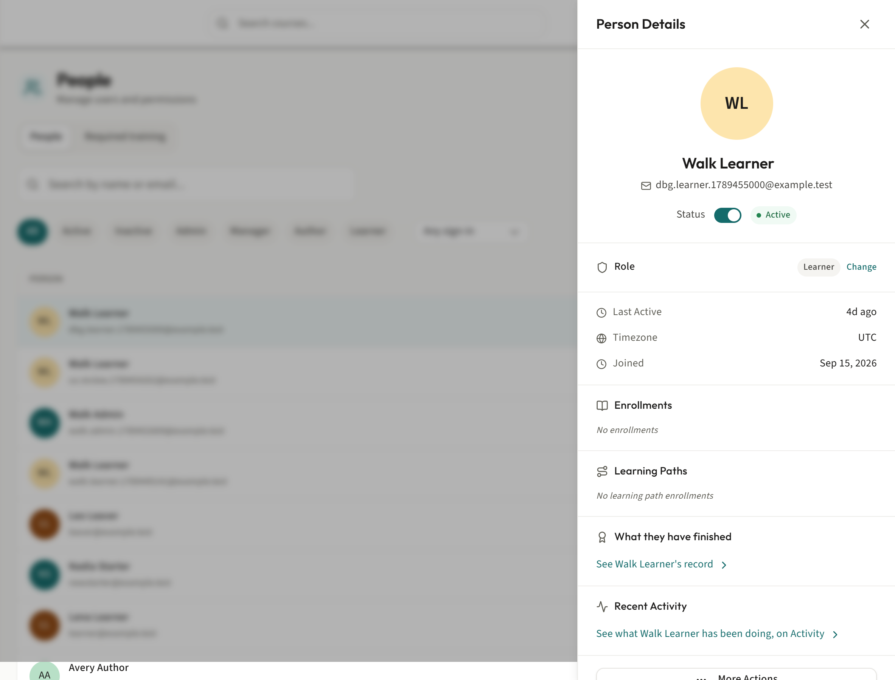
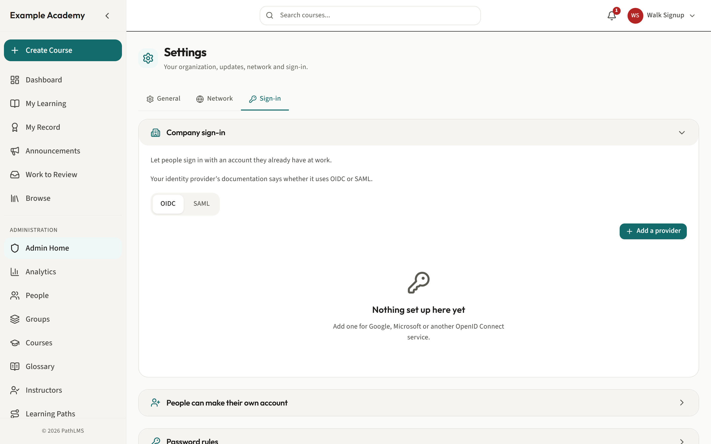
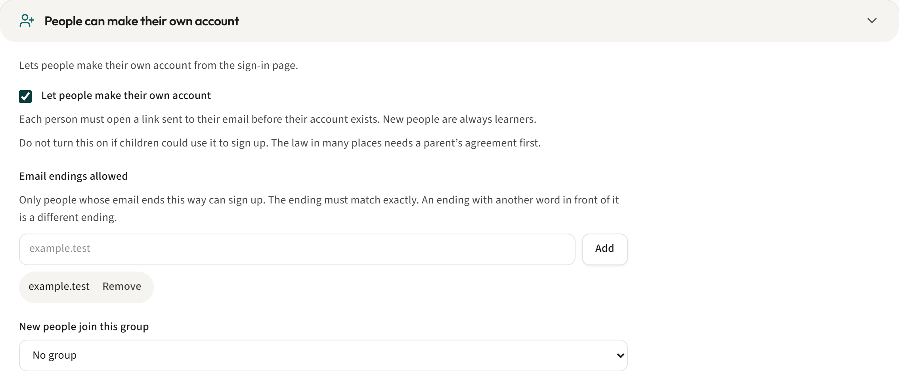
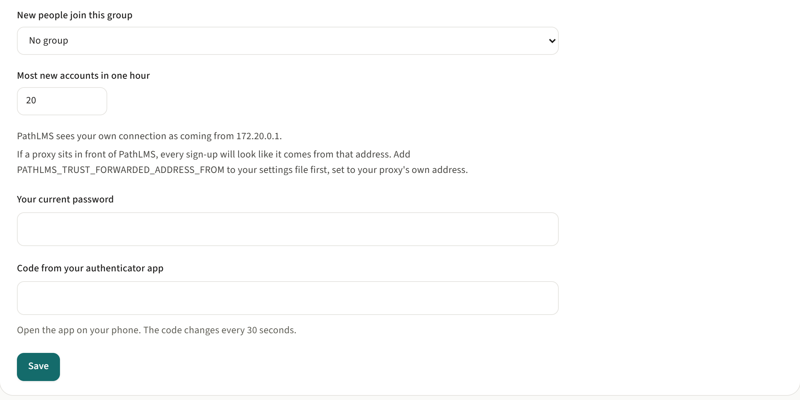
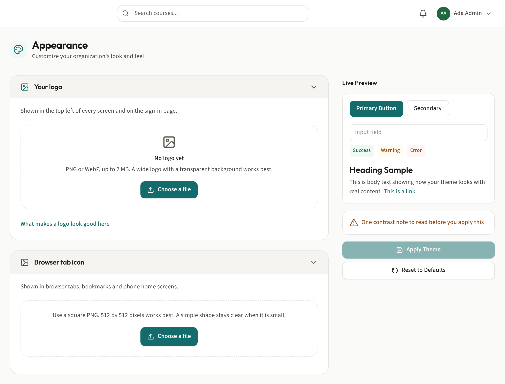
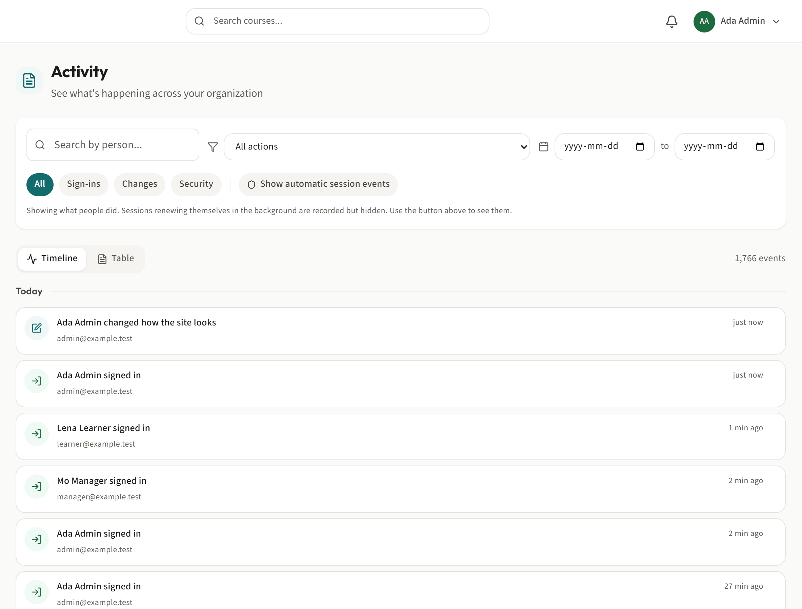
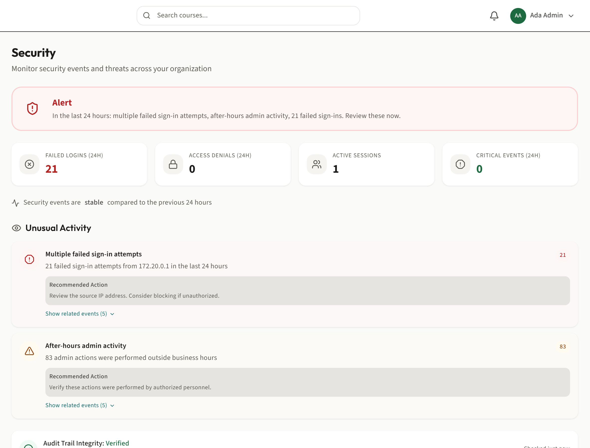
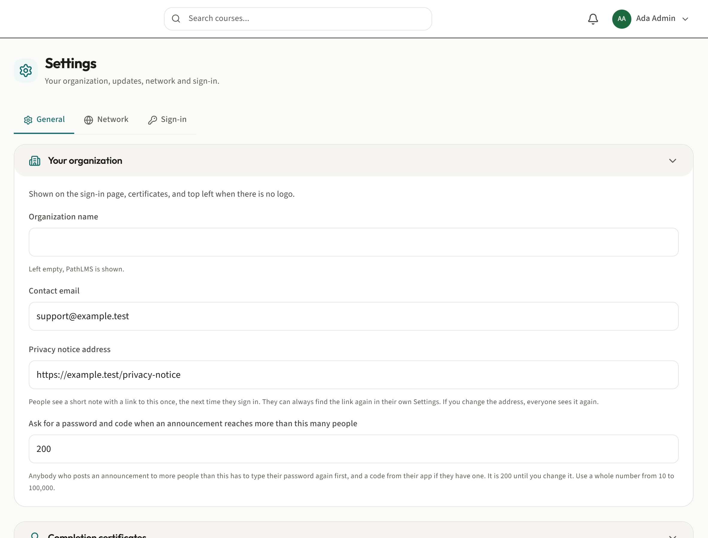

# The administrator guide

This is for an administrator. You can do everything in PathLMS. That
includes everything in the manager guide and the author guide, plus the
parts of the system nobody else can touch: accounts, roles, company
sign-in, branding, and the record of who did what.

With this role you can:

- Create accounts, reset passwords, and change anyone's role.
- Set up company sign-in with your own identity provider.
- Brand the site with your own logo and colors.
- Review the record of important actions, and check nobody has tampered
  with it.
- Manage general settings, network settings, and updates.

When you sign in, PathLMS opens **Admin Home**. It has a **Get Started**
checklist for a new site, and the sidebar links to everything below.

## Creating an account

Why: everyone needs an account before they can sign in and be enrolled on
anything. As an administrator, you can create one for any role except
administrator itself.

1. In the sidebar, click **People**.
2. Click **Add Person**.
3. Fill in their first name, last name and email address.
4. Choose a **Role**: Learner, Author, or Manager. If you choose Manager, a
   **Group** box appears. Pick the group they will look after.
5. Click **Add Person**. If you chose Manager, PathLMS now asks for your own
   password and the code from your authenticator app. Type them and click
   **Add them as a manager**.

What happens: a password is generated automatically and shown to you once,
so you can pass it on to them. They sign in with it, and PathLMS asks them to
choose a password of their own before anything else.

You will notice Admin is not offered here. There is no "create an
administrator" form. Instead, you make someone an administrator by
changing an existing person's role, covered next.

## Adding many people from a file

Why: typing fifty accounts one at a time is slow. A file does it in one go.
Only an administrator for the whole site can do this.

1. In the sidebar, click **People**.
2. Click **Add from a spreadsheet**.
3. Click **Download an example file**, fill it in, and save it as a CSV file.
   The file can be up to 2 MB.
4. Choose the file. PathLMS shows what will happen to every row. Nothing is
   saved yet. Click **Next**.
5. Choose one **Role** for everybody in the file, and a **Group** if you want
   one. Click **Next**.
6. Check the summary, then click the button that adds them. It asks for your
   password and the code from your authenticator app.

What happens: each new person gets an account with no password. If mail is set
up, each one is emailed a link to choose their own. The link works once and
lasts seven days. If mail is not set up, nobody is told yet, and you can send
the emails later. Anyone who already has an account is left as they are.

To see what you added, click **Past imports**, beside Add from a spreadsheet.
Each import there has **Send the set-up emails now** and **Undo this import**.
Undo removes the people that import added. It keeps anyone somebody else has
since done something with.

## Changing someone's role

Why: people move into different responsibilities, and their account
should move with them. This is also how you make a new administrator:
there is no separate form for it, you promote an existing account.

1. On the People screen, click a person's row to open their detail panel.
2. In the Role line, click **Change**. A list of six roles opens, each with
   one line saying what it can do.
3. Choose the new role. If you choose Manager, pick the group they will look
   after and click **Make them a manager**. If you choose Administrator of
   one group, pick the group they will run and click **Make them a group
   admin**.
4. If PathLMS asks, confirm the change. For Manager, Administrator of one
   group and Admin it asks for your password and code.

What happens matters more here than anywhere else on this screen, so read
it carefully.

**Important.** Making someone a manager, an administrator, or an
administrator of one group, asks you to prove it is really you: your current
password, and the code from your authenticator app. Adding a new person as a
manager asks the same. This is not the usual click-and-done. These roles
give a person real power over other people, and that power outlives the
browser session it was granted from, so a plain "are you sure" is not enough
to stop someone else pressing the button on your signed-in screen. Ordinary
account work, like adding a learner or an author, or turning an account on,
does not ask for anything extra.

If the change is refused, for example because the password was wrong, the
person keeps the role they already had. Nothing changes until the server
agrees.

## Resetting a password

Why: someone has forgotten their password, or you suspect their account
has been compromised, and you need to get them back in safely without
knowing their old password.

1. On the People screen, open the person's detail panel.
2. Open **More Actions** and choose **Reset Password**.
3. Prove it is you: type your own password and the code from your
   authenticator app.
4. Confirm.

What happens: a new password is generated and shown to you once. Their old
password stops working immediately. The next time they sign in, PathLMS asks
them to choose a password of their own. You do not need to tell them to
change it.

## Putting people in a group

Why: a group decides which training people get and which manager looks after
them.

1. In the sidebar, click **Groups**, then click the group.
2. In the panel that opens, click **Add people**, beside the number of members.
3. Type in **Find a person** to narrow the list, and tick each person.
4. Click **Add people**.

The same panel has **Enroll this group**, **Post an announcement** and **Add a
group inside this one**.

## The roles

Learner, Author, Manager, Instructor, Administrator of one group, and Admin
are the choices PathLMS offers. An instructor reviews handed-in work for the
courses and groups you give them. Everything else works as it does for a
learner. An administrator of one group looks after one group and the groups
under it. They see and change only the people in those groups. On the People
list they show as Group admin. For the full one-line summary of what each
role is for, see [the note on the roles](README.md#a-note-on-the-roles) in
the guide index.

## Forgetting a person, and giving them a copy of their data

Why: somebody leaves, or asks you to remove what PathLMS keeps about them.
Their training records stay, so course records and reports stay true. Their
name and email address are taken off them.

1. In the sidebar, click **People**, then click the person.
2. Open **More Actions** and choose **Forget this person**.
3. Type the person's email address where the box asks for it.
4. Type your password and the code from your authenticator app.
5. Click **Forget this person**.

What happens: their name, email address and settings are removed, and they
are signed out everywhere. What they completed is kept. This cannot be undone.

A person can also ask to be forgotten from their own Settings. When they do,
every administrator gets a notice. Open the person and either forget them or
write back with a reason. They see your reason.

To give a person a copy of everything PathLMS keeps about them, open
**More Actions** and choose **Download their data**. It asks for your password
and code. Your name and the time are written in the activity log.

## Taking a badge back

Why: a badge was given by mistake.

1. On the People screen, click the person, then open their record.
2. In the **Badges** section, click **Take this badge back** beside the badge.
3. Write why it is being taken back. Write facts only: the person can see this
   in the copy of their data they can download.
4. Type your password and the code from your authenticator app, then click
   **Take badge back**.

What happens: the badge stops showing on their record. PathLMS keeps a note of
who took it back, when and why. To fix the reason later, find the badge under
**Badges taken back** on the same record and click **Correct the reason**.

## The authenticator app, and resetting one for someone

Why: once someone's account can do anything sensitive, a password on its
own is not enough. The authenticator app is a second proof: a code from a
phone app that changes every 30 seconds, set up once and then just used.
As an administrator, you also need to be able to help someone who has
lost their phone and is locked out of that second step.

Setting it up happens once, on the account it belongs to, not on every
sensitive action. It gives that person ten one-time recovery codes at the
same time, for the day their phone is genuinely gone.

1. On the People screen, open the person's detail panel.
2. Choose **Reset authenticator app** from the panel's actions.
3. Prove it is you with your current password.
4. Confirm.

What happens: their old app stops being accepted, and they will be asked
to set up a new one the next time it is needed. Do this only when you are
sure the request is really from them: it is exactly the kind of thing an
attacker holding a stolen password would also ask for.

## Setting up company sign-in

Why: if your organization already has its own identity system, such as
Okta or Azure AD, you can let people sign in with it instead of a PathLMS
password. This is one less password for everyone to remember, and one
less place a leaked password can be used.

1. In the sidebar, click **Settings**.
2. Click the **Sign-in** tab.
3. Add an OIDC or SAML provider, filling in the details your identity
   system gives you.
4. Turn the provider on, and drag it into the order you want it offered
   in, if you have more than one.

What happens: people signing in see the provider you added as an option,
in the order you set. You can turn any provider off again without
deleting it.

## Letting people make their own account

Why: if you do not want to add everyone yourself, people can make their own
account from the sign-in page. It is off until you switch it on.

Two things must be set up first. The link is sent by email, so your settings
file needs the email lines. See [Setting up email](../deploy/EMAIL.md). And
people must be able to read your privacy notice before they sign up, so its
address must be filled in on the **General** tab. Until both are done, the
switch is greyed out and the section says what is missing.

1. In the sidebar, click **Settings**, then the **Sign-in** tab.
2. Open the section **People can make their own account**.

   

3. Under **Email endings allowed**, type the ending people must have, such as
   your company's, and press **Add**. Only people whose email ends this way can
   sign up. Add as many as you need.
4. Under **New people join this group**, choose a group, or leave it on
   **No group**.
5. Under **Most new accounts in one hour**, keep the number or change it. It
   is a whole number from 1 to 200.
6. Switch on **Let people make their own account**.
7. Type your password and the code from your authenticator app, then press
   **Save**.

   

What happens: the sign-in page now says "New here? Make an account". A person
types their email address and gets a link. The link lasts 24 hours. It opens a
page where they type their name and choose a password. Then they are signed in.
Everyone who signs up this way is a learner.

You can see who joined this way on the **People** screen. Open the box
that says **Any way of joining** and choose **Signed up themselves**.

Switching it off, taking an ending away and lowering the hourly number never
ask for your password. Opening it, adding an ending, changing the group and
raising the number do.

Recommendation: do not turn this on if children could use it to sign up. The
law in many places needs a parent's agreement first.

## Branding the site

Why: a training platform that looks like your own organization, rather
than a generic product, is easier for people to trust and recognize.

1. In the sidebar, click **Appearance**.
2. Upload your logo.
3. Set your brand color.
4. Set the sign-in background image.
5. Set the browser tab icon.

What happens: these changes apply across the whole site immediately,
including the sign-in screen people see before they have even logged in.

## Reviewing activity, and checking it has not been tampered with

Why: when something goes wrong, or you simply need to know who did what
and when, the Activity screen is the record. Because that record itself
could theoretically be altered by someone with deep access, Security
exists to check that it has not been.

1. In the sidebar, click **Activity** to see the record of important
   actions taken across the system.
2. In the sidebar, click **Security** to verify that record has not been
   tampered with.

What happens: Activity shows you a chronological list you can search and
export. Security tells you plainly whether every entry checks out, or
whether something in the chain has been altered.

Security also counts **Values set aside**. A set-aside value is a saved
secret that no key on this server can open. A sign-in provider password and
a certificate key are examples. PathLMS keeps it and stops using it, so
nothing else fails. If you upload the certificate again with a working key,
it comes back.

Recommendation: if you ever suspect an account has been compromised, check
Security first. It tells you whether you can trust what Activity is about
to show you.

## Settings: General, Network and Sign-in

Why: these three tabs hold the administration that keeps the platform
running, separate from the day-to-day work of managing people and
courses.

1. In the sidebar, click **Settings**.
2. The **General** tab has four sections. **Your organization** holds the
   organization name, the contact email, the address of your privacy notice,
   and how many people an announcement can reach before PathLMS asks the
   person posting it for their password. **Completion certificates** turns
   certificates on or off. **Uploaded courses** holds the settings for
   courses made in other tools. **Updates** is where you start a platform
   update. See
   [UPDATES.md](../UPDATES.md) for the full walkthrough of what an update
   does and the safety checks it runs before anything changes.
3. The **Network** tab holds the address, ports and encryption this
   installation uses. This is deployment territory: see
   [DEPLOYMENT.md](../DEPLOYMENT.md) and
   [BEHIND-A-PROXY.md](../deploy/BEHIND-A-PROXY.md) for what these
   settings mean and how to change them safely.
4. The **Sign-in** tab holds company sign-in, covered above in
   [Setting up company sign-in](#setting-up-company-sign-in), the switch for
   [letting people make their own account](#letting-people-make-their-own-account),
   and **Password rules**.

For branding, which General points to rather than duplicating, see
[Branding the site](#branding-the-site) above.

## Backups

Why: you need to know your training records are safe, and what to do if
you ever need to restore them.

There is no backups screen in PathLMS today, and it is worth saying that
plainly rather than leaving you to hunt for a button that does not exist.
Backups run automatically to a directory on the server. Taking one by
hand, or restoring one, is a command run on the server itself, not a
click in the browser. This is documented for whoever deployed your
installation, since it depends on how and where the server is set up. See
[After it starts](../AFTER-IT-STARTS.md) for the backup and restore steps.

## Related guides

- [Courses, folders and learning paths](courses-folders-and-paths.md), for
  how training itself is built and organized.
- [The manager guide](manager.md), for the day-to-day work of enrolling
  people and reading reports, which you can also do.
- [How updates work](../UPDATES.md), for the full walkthrough of updating
  the platform.
- [Deploying PathLMS](../DEPLOYMENT.md) and
  [Behind a proxy](../deploy/BEHIND-A-PROXY.md), for the deployment and
  network side of Settings.
