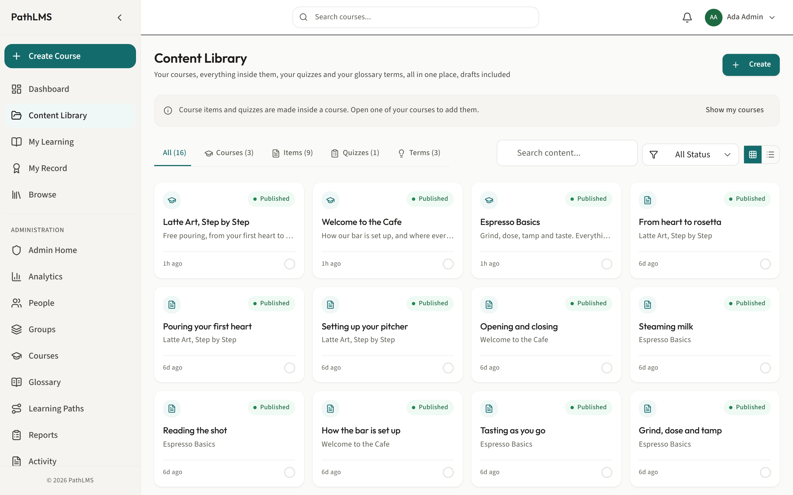
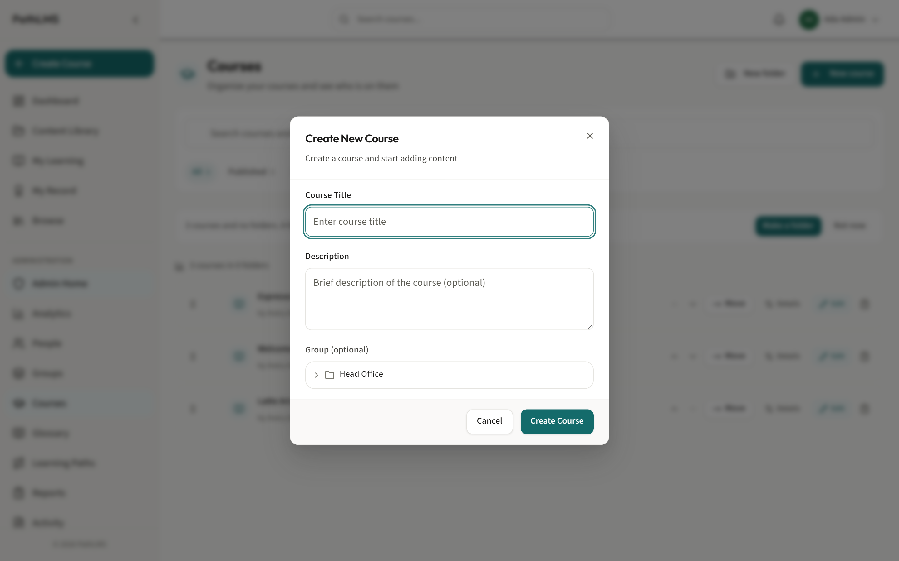
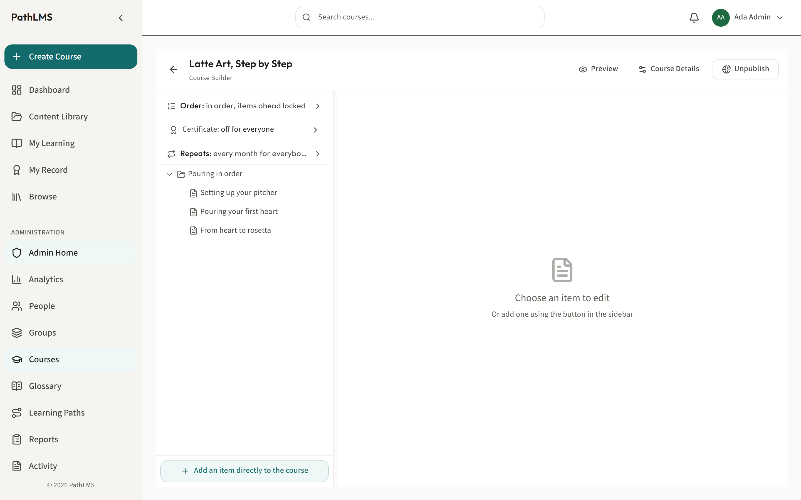
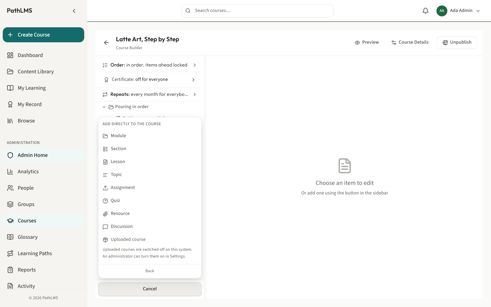
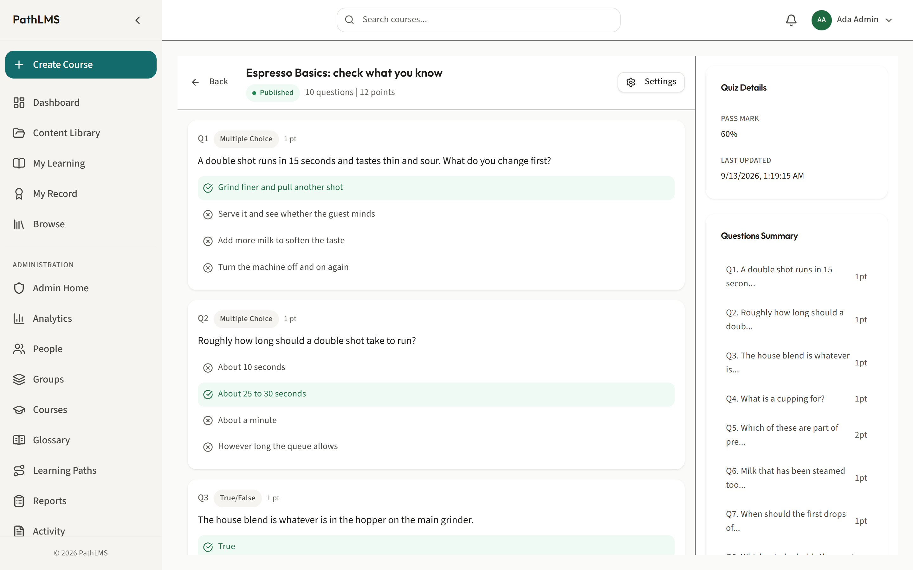
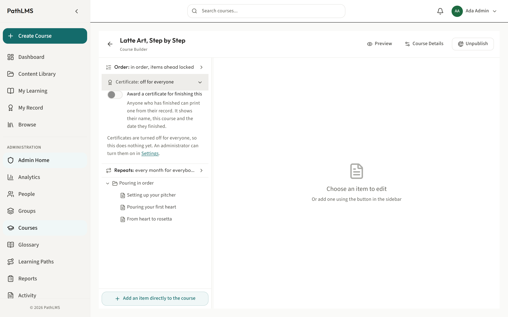
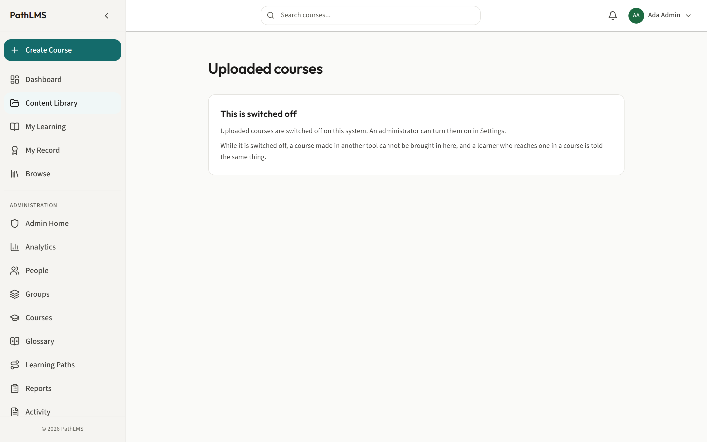

# The author guide

This is for anyone who builds training in PathLMS. You write courses, fill
them with lessons and quizzes, and decide how each one is put together.

With this role you can:

- See everything you have authored in one place, across every course.
- Create a course and build its outline: modules, sections, lessons, topics,
  assignments, quizzes, resources and more.
- Write a quiz, set its pass mark and publish it.
- Decide whether finishing a course awards a certificate.
- Bring in a course made in another tool, if that is switched on here.
- Publish, unpublish, preview and export what you build.

This guide does not cover folders or learning paths in depth: for how a course
fits into a folder or a learning path, see
[courses, folders and learning paths](courses-folders-and-paths.md). It also
only points at the glossary rather than covering it fully: see
[the glossary](glossary.md) for that.

## Where your work lives: the Content Library

Why: once you have written more than one or two courses, you need one place
that shows you everything you have made, drafts included, rather than hunting
through the catalogue for it.

1. In the sidebar, click **Content Library**. The address is `/content`.
2. Switch between the tabs to narrow what you see: **Courses**, **Items** (the
   lessons, topics and other pieces inside your courses), **Quizzes**, or
   **Terms** (your glossary words).
3. Click anything in the list to open its editor.

What happens: this list is yours. It shows what you have authored, whatever
state it is in, so a half-finished draft is never lost simply because it has
not been published yet.

## Creating a course

Why: a course is where the teaching itself lives. Everything else, folders,
learning paths, certificates, is built around it.

1. Press **Create Course**, either in the sidebar or from the Content Library.
2. In the **Create New Course** dialog, give it a name. A plain, specific name
   helps everyone later: "Espresso Machine Safety" tells people what it is,
   "Module 3" tells them nothing.
3. Choose where it lives, and press **Create Course** to confirm.

What happens: PathLMS opens the new course straight into Course Builder, ready
for you to start filling it in. It starts as a draft, so nobody can enroll on it
and nobody sees it in the catalogue until you publish it.

---

## Building a course: the Course Builder

Why: this is where a course actually gets written. Everything about its
content, its structure and its settings lives here.

Course Builder has two halves. The left side is the outline: a tree of
everything in your course, which you can expand, collapse and rearrange. The
right side is the editor for whichever item you have selected on the left.

### Add an item to the outline

Why: a course is built one item at a time, and where you place each one
decides the shape of what a learner experiences.

1. Select the item you want to add something near, or select nothing to add at
   the top level of the course.
2. Press **Add something inside this** to nest inside the selected item,
   **Add something after this** to place a new item beside it, or **Add an item
   directly to the course** to add at the top level.
3. Choose the kind of item from the menu. In the order they are offered:
   - **Module** and **Section** organize the course into parts.
   - **Lesson** is ordinary written content a learner reads.
   - **Topic** is writing at a finer grain than a lesson. It can sit before a
     lesson, inside a lesson, or inside another topic, which makes it useful
     for breaking a long lesson into smaller pieces without making each piece
     its own lesson.
   - **Assignment** gives instructions only. A learner cannot hand work in
     through PathLMS; use this for something they do outside the system.
   - **Quiz** checks what a learner has understood. See below for how to build
     one.
   - **Resource** and **Discussion** round things out, though Discussion is a
     placeholder today: there is no real discussion behind it yet.
   - **Uploaded course** places a whole packaged course inside this one.
     Nothing can nest inside it, and it can only sit at the top level of the
     course, or inside a Module or Section.

What happens: the new item appears in the outline, selected, ready for you to
fill in on the right.

### Reorder and nest items

Why: the shape of your outline is what a learner reads as the shape of your
course. Getting it right makes a course easy to follow; getting it wrong buries
things a learner needed to see.

1. Use the drag handle beside an item to drag it to a new place in the tree.
2. If dragging is awkward, use the keyboard alternative: the move up and move
   down controls on the item move it without a mouse.
3. Nest items inside each other as deep as you need, up to ten levels.

Recommendation: just because you can nest ten levels deep does not mean you
should. Favour a shallow structure over deep nesting: a clear module, then
lesson, shape is easier for you to maintain and easier for a learner to find
their way through than a tree with topics inside topics inside sections. Save
the depth for the rare course that genuinely needs it.

### Write a lesson

Why: this is the actual teaching.

1. Select a **Lesson** or **Topic** item in the outline.
2. Write in the content editor on the right, the same way you would in any rich
   text editor.
3. To mark a word as a glossary term so a learner can hover it for its meaning,
   select the word and choose the term option on the toolbar, beside Link. See
   [the glossary](glossary.md) for the full guide to this.

What happens: your writing is saved as you go, and a learner opening this item
in the player sees exactly what you wrote, with any glossary terms live.

### Add a quiz

Why: a quiz confirms a learner actually understood something, rather than
simply having scrolled past it.

1. Build and edit the quiz's own questions and settings at
   `/assessments/:assessmentId/edit`, reachable by opening it from the
   **Quizzes** tab in the Content Library. Add your questions, set the
   **Pass mark**, and press **Publish** when it is ready.
2. Back in Course Builder, add a **Quiz** item to your outline where you want
   the learner to meet it.
3. Select the Quiz item, and in its **Quiz Settings** box, give it the
   identifying code of the quiz you built, in the form
   `{"assessment_id": "..."}`. You can find that code in the address bar while
   editing the quiz.

What happens: the quiz item in your course now leads to that quiz. A learner
who reaches it must pass it, against the pass mark you set, before the course
lets them mark it finished.

Recommendation: write a quiz to confirm learning, not to trick people. A
question that hinges on a wording trap or an obscure exception tells you
nothing about whether the lesson worked, and it leaves a learner feeling
cheated rather than tested.

### Turn on a certificate

Why: finishing a course is worth marking, and a certificate is something a
learner can keep and show.

1. In Course Builder's outline panel, find the row that reads **Certificate:**
   followed by its current state.
2. Open it, and use the switch to turn a certificate on or off for this course.
3. The row's summary tells you exactly where you stand: **not awarded**,
   **awarded on completion**, or **off for everyone** if an administrator has
   turned certificates off for the whole system. If it is off for everyone, your
   switch here does nothing yet, and the row says so and points at the setting
   that controls it.

What happens: anyone who finishes a course with its certificate switched on can
print theirs from their own record.

### Rename a course or change its description

Why: a course's name and description are the first thing anybody reads about
it, on the catalogue card and on its own page.

1. In Course Builder's header, press **Course Details**.
2. Change the **Course name** or the **Description**.
3. Save your changes.

What happens: the new name and description appear everywhere the course is
shown, including its catalogue card.

### Publish, unpublish, preview and export

Why: a course is a draft until you decide it is ready, and you often want to
see it as a learner would before that day comes.

1. Press **Preview** at any time to open the course exactly as a learner would
   see its own page.
2. Press **Publish** when the course is ready for people to enroll on it.
   PathLMS asks you to confirm first, because publishing is the moment the
   course becomes visible in the catalogue.
3. Press **Unpublish** to take a live course back out of the catalogue. Nobody
   new can join, but everyone already enrolled keeps their place and their
   progress.
4. Press **Export** to take a copy of the course out as a file, for example to
   hand to somebody running a different system.

What happens: publishing and unpublishing both ask you to confirm before
anything changes, so neither one is a single accidental click away.

---

## Bringing in a course made elsewhere

Why: not every course has to be built here. If your organization already owns
training packaged in another tool, you can bring the whole package in rather
than rebuilding it by hand.

This is only available if an administrator has switched the feature on. When it
is, you will see **Uploaded Courses** in the sidebar.

1. In the sidebar, click **Uploaded Courses**. The address is
   `/content/uploaded-courses`.
2. Press **Choose a file**, or drag your file onto the drop area, to bring in
   your packaged course.
3. Wait while PathLMS unpacks and checks it. This can take a few minutes for a
   large package, and the screen tells you it is still working rather than
   leaving you guessing.

What happens: once it is ready, the course appears in your list here, and it
can then be placed into a course's outline as an **Uploaded course** item, at
the top level or inside a Module or Section.

---

## A few recommendations

- **Favour a shallow structure over deep nesting.** A clear module, then
  lesson, shape beats a tree with topics inside topics. Save real depth for the
  rare course that needs it.
- **Write a quiz to confirm learning, not to trick people.** The point is to
  find out whether the lesson worked, not to catch someone out.
- **Give a course a plain, specific name.** It is the first thing anyone reads
  about it, on the catalogue card and in your own Content Library.
- **Keep a course in draft until it is genuinely ready.** Publishing is one
  click and easy to undo, but a half-built course in the catalogue teaches
  people the wrong thing before you have finished writing it.

---

Related guides: [courses, folders and learning paths](courses-folders-and-paths.md)
for how a course fits into a folder or a learning path, and
[the glossary](glossary.md) for giving a word the right meaning inside your
course.
