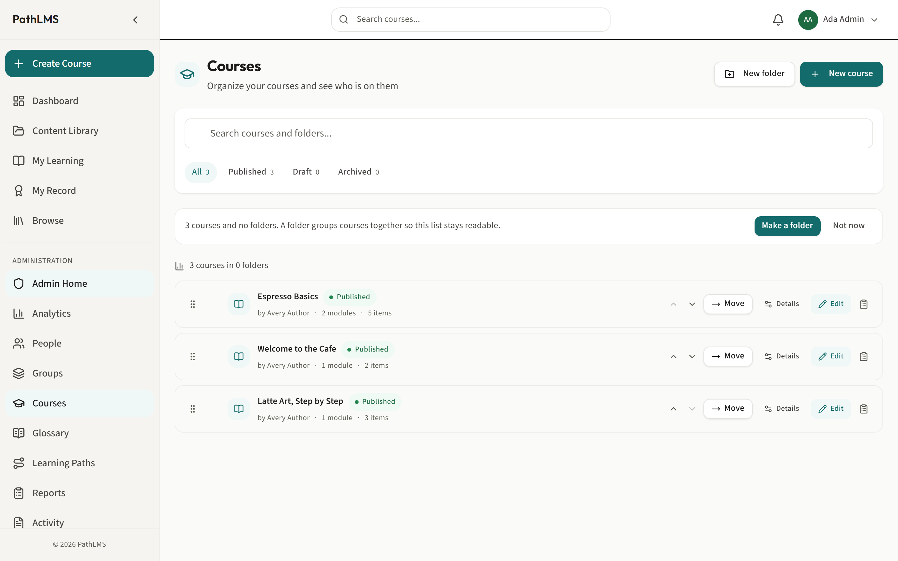
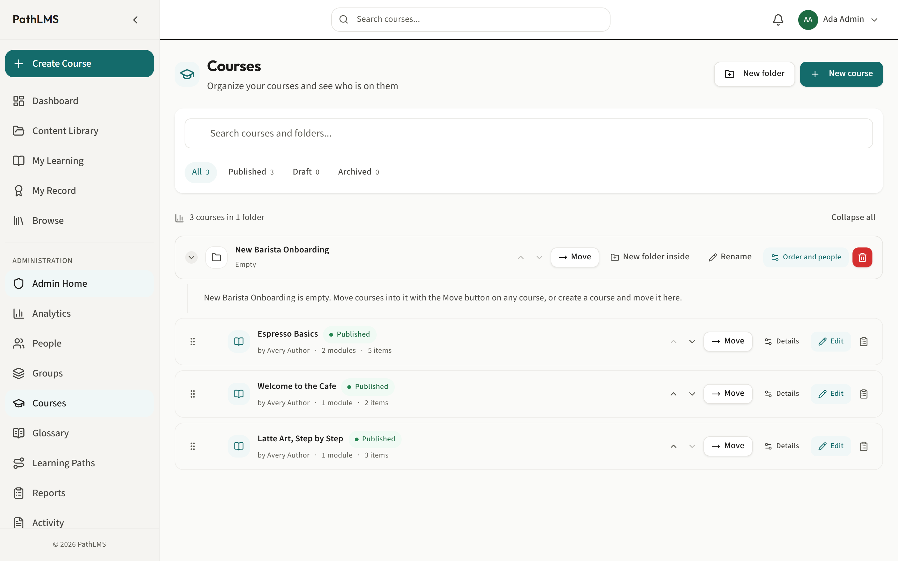
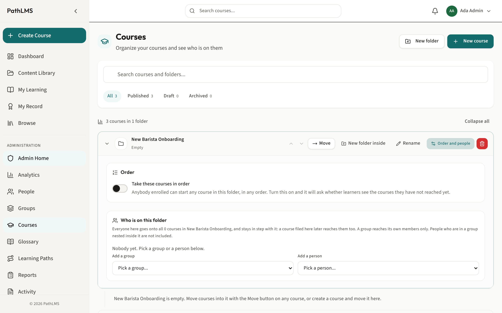
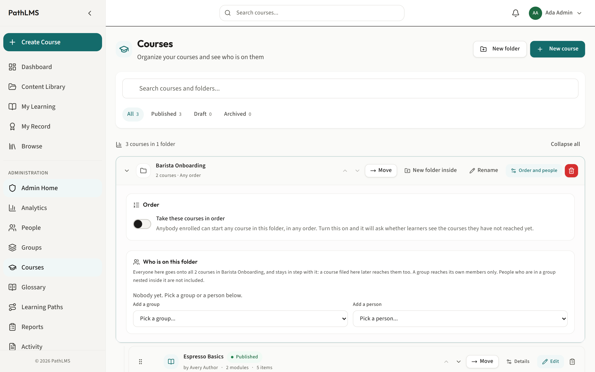
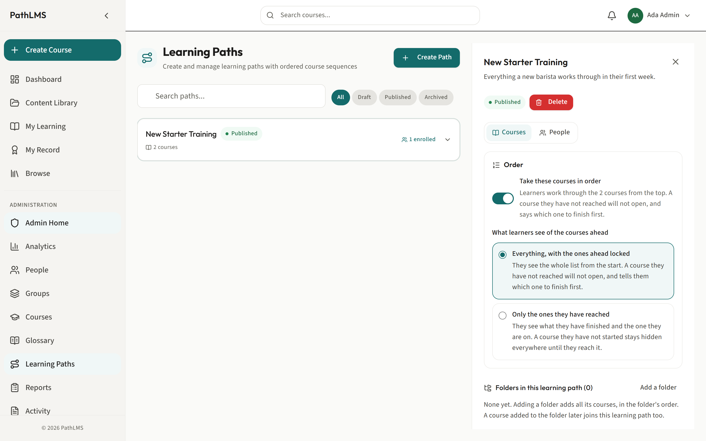

# Courses, folders and learning paths

This is the guide to read first if you make training. Once these three things
are clear, everything else in PathLMS falls into place.

The three are easy to mix up because they all hold courses in some way. They do
very different jobs. Here they are in one breath, then the rest of this guide
takes each one slowly.

- A **course** is the training itself. Lessons, a quiz, the thing a person
  actually works through.
- A **folder** is a filing drawer for courses. It keeps your library tidy, and
  it can also put a whole group of people onto every course inside it at once.
- A **learning path** is a planned journey through several courses, in an order
  you decide.

## Why you would choose each one

Start from what you are trying to do, not from the feature.

**You have one subject to teach.** Make a course. That is the whole answer. A
course can be as short as one lesson or as long as you like.

**Your library is getting hard to find things in.** Make folders and file your
courses into them, the way you would sort papers into drawers. Folders are for
you and the people who build training. A learner never has to understand your
folders.

**You want a team to do a set of courses, and you do not care what order.** Put
the team on a folder. Everyone in the folder gets every course in it, and anyone
who joins the team later gets them too, without you lifting a finger.

**You want people to do courses in a set order, building on each other.** Make a
learning path. This is the one to reach for when the order matters: coffee
basics before the espresso machine, the welcome before the deep dive.

The rest of this guide shows you how to build and look after each one.

---

## Courses

A course is where the teaching lives. This guide is about how a course fits into
the bigger picture. For how to build the inside of a course, its lessons,
topics, quizzes and certificates, see the [author guide](author.md).

### Make a course

Why: everything else here is about organizing courses, so you need at least one
to organize.

1. Go to **Courses** in the menu. The address is `/admin/courses`.
2. Press **New course** at the top.
3. Give it a name and press create. A plain, specific name helps everyone later:
   "Espresso Machine Safety" tells people what it is, "Module 3" tells them
   nothing.
4. PathLMS opens the course builder so you can start filling it in.

A new course starts as a draft. Nobody can be put on it until you publish it, so
you can take your time building it without anyone seeing half-finished work.

---

## Folders

A folder is a drawer for your courses. It does two jobs, and it is worth keeping
them separate in your mind because the second one surprises people.

The first job is tidiness. A folder groups courses that belong together so your
library does not become one long list. Folders can sit inside folders, so you
can build a filing system as deep as you need.

The second job is delivery. You can put a group of people onto a folder, and
every course in that folder lands on every one of them. This is what a lot of
people mean when they say "course group": a folder with a team attached to it.

### Make a folder and file courses into it

Why: a tidy library is faster to work in, and a folder is the thing you later
attach a team to.

1. On the **Courses** screen, press **New folder**.
2. Give it a name that describes what goes in it, like "New Barista Onboarding"
   or "Baristas".
3. To put a course into the folder, drag the course onto the folder. You can
   also move a course with its own menu. A course lives in one folder at a time,
   so moving it into a folder takes it out of wherever it was.
4. To make a folder inside a folder, open the folder and press **New folder
   inside**.

Recommendation: do not build a deep stack of folders when a shallow one will do.
Two levels is plenty for most libraries. The deeper you nest, the more clicks it
takes you and everyone else to find a course.

### Put a team on a folder

Why: this is the fast way to give a whole group the same set of courses, and to
keep giving it to them. It is a standing arrangement, not a one-time push. Add a
person to the group next month and they get the courses. File a new course into
the folder and everyone on the folder gets that too. You do not have to remember
to come back.

1. On the **Courses** screen, open the folder by clicking it.
2. Find the section headed **Who is on this folder**.
3. Under **Add a group**, pick a group. Everyone in that group goes onto every
   course in the folder. Under **Add a person**, pick one person instead.
4. To take someone off, press **Take off** beside their name. They keep any
   course they have already started or finished. A course they had only because
   of this folder, and had not started, is taken back.

One thing to know: adding a group reaches the people who are directly in that
group. It does not reach into smaller groups nested inside it. If you want those
people too, add their group as well.

### Make a folder's courses run in order

Why: sometimes the courses in a folder build on each other, and you want people
to do them from the top rather than jumping around.

1. Open the folder and find the **Order** section.
2. Turn on **Take these courses in order**.
3. PathLMS then asks a question worth answering carefully: should people **see**
   the courses they have not reached yet, or not?
   - **Locked** shows every course in the list, but a course they have not
     reached will not open, and it tells them which one to finish first. Good
     when you want people to see what is coming.
   - **Hidden** shows only the courses they have finished and the one they are
     on. The rest stay out of sight until they get there. Good when the road
     ahead would feel long or off-putting.
4. Turning order on takes nobody off any course. It only decides how much of the
   folder they can open at a time. If people are already partway through, PathLMS
   tells you how many before you confirm, and nobody loses work they have done.

If a folder has folders inside it, everything is taken in one order: the courses
filed directly in the folder come first, then each folder inside it in turn.

---

## Learning paths

A learning path is a planned journey through several courses. You decide which
courses are in it and, if you want, the order they are done in.

This is the tool to reach for when the order and the sense of a journey matter.
A folder taken in order can also enforce a sequence, but a learning path is
built for it: it is a thing a learner can see, enroll in, and work down, with its
own page and its own finish line.

### Make a learning path

Why: you have a set of courses that add up to something bigger than any one of
them, and you want people to experience them as one journey.

1. Go to **Learning Paths** in the menu. The address is `/admin/learning-paths`.
2. Press **Create Path**.
3. Give it a name and, if you like, a short description of what someone gets from
   finishing it. Press create.
4. The new path opens so you can start adding courses. It starts as a draft, so
   nobody sees it until you publish it.

### Add courses to a path

Why: the courses are the path. Without them there is nothing to do.

1. With the path open, use the course picker to search your published courses.
2. Choose a course to add it. You can only add courses you own, so if a course
   belongs to someone else, ask them or an administrator to add it.
3. Repeat for each course the path should contain.

When you add a course to a path that people are already on, they get the new
course too. PathLMS tells you how many people that reached, so you are never left
guessing whether it worked.

### Put the courses in order

Why: the whole point of many paths is that one course prepares people for the
next.

1. With the path open, arrange the courses top to bottom into the order you want.
2. If the path is taken in order, each course opens only when the one before it
   is finished. The learner sees a clear note telling them what to finish first.

Recommendation: put the gentlest, most welcoming course first. The first course
sets the tone, and a hard one at the front is where people give up.

### Put people on a learning path

Why: a path helps nobody until people are on it.

1. With the path open, use **Enroll people or groups**.
2. Pick the people, or a whole group, who should take the path.
3. PathLMS tells you plainly who it could and could not enroll, and why, so a
   suspended or already-enrolled person is never a silent gap. It never reports
   success for people it quietly skipped.

To see who is on a path and how far each person has got, open the path and switch
to its **People** side. (Administrators and managers see this. An author who
builds paths does not manage who is on them.)

### What happens to progress when you change a path

This is the part people worry about, so here it is plainly.

Taking a course off a path does not take the course away from anyone. It only
stops that course counting toward the path. Anyone partway through it keeps their
place.

Adding, removing, publishing or unpublishing a course all keep everyone's
progress honest: PathLMS works out each person's real position again, and finishes
anyone who has genuinely done everything the path still asks. A completion is
never quietly taken back. Once someone has finished, they stay finished.

---

## Which one should I use? A short answer

- **Just teach one thing.** A course.
- **Keep my library tidy.** Folders.
- **Give a team a bundle of courses, order not important, and keep giving it as
  the team changes.** Put the team on a folder.
- **Walk people through courses in a set order, as a journey, with a finish
  line.** A learning path.

You can use all of these together. A course can sit in a folder and also be part
of a learning path. Pick the tool that matches what you are trying to achieve,
and do not feel you have to use all three at once.

---

Related guides: the [author guide](author.md) for building the inside of a
course, the [manager guide](manager.md) for getting training to people, and
[the glossary](glossary.md) for giving words the right meaning inside a course.
