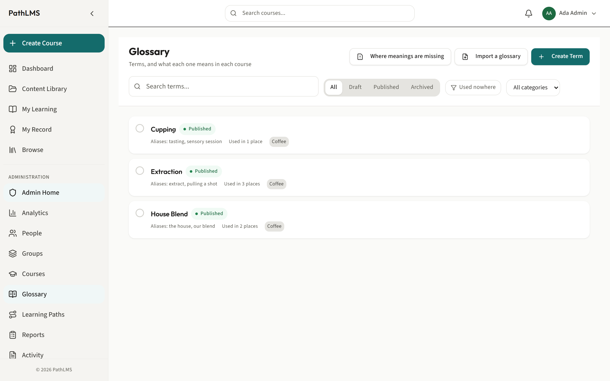
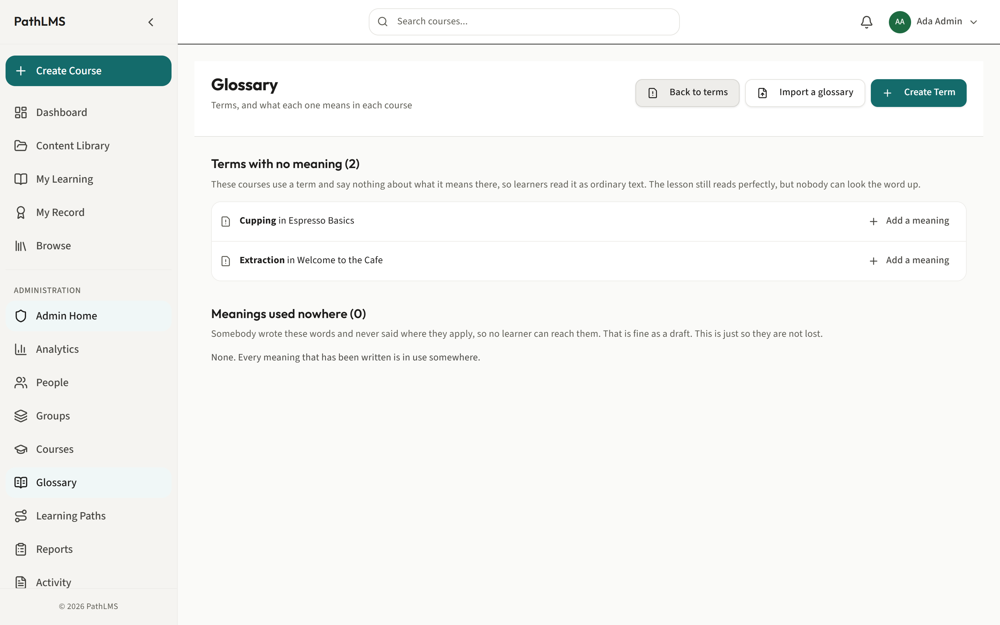
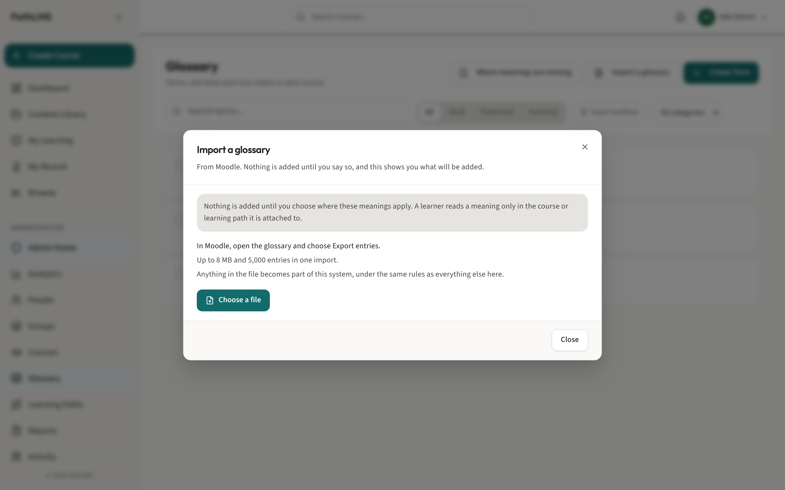

# The glossary

The glossary is one of the quietest, most useful things PathLMS does. It lets a
learner understand a word without leaving the page they are reading, and it lets
the same word mean different things in different courses.

This guide explains what it is, why it is worth the small effort, and how to
build and look after it.

## Why a glossary is worth it

Every field has its own words. A new starter reading a course hits a term they
do not know, and they have a choice: stop and go looking it up, or guess and
carry on. Both are bad. Looking it up breaks their concentration. Guessing means
they learn the next part on top of a misunderstanding.

The glossary removes the choice. A word that has a meaning shows a small marker
in the lesson, and hovering it shows the meaning right there. The learner never
leaves the page, never loses their place, and never has to guess.

Here is the part that makes it genuinely clever. A word can mean one thing in one
course and something else in another. "Cell" in a biology course is not "cell" in
a spreadsheet course. PathLMS keeps the meaning tied to the course, so each
learner sees the meaning that is right for what they are learning. You are never
forced into one meaning for the whole platform.

## How it fits together

There are two separate things, and keeping them apart is the key to
understanding the glossary.

- **The term** is just the word itself, like "throughput" or "escalation". It is
  created once and lives in the glossary list.
- **The meaning** is what that word means, and it is written per course. The same
  term can carry a different meaning in each course that uses it.

So the glossary list is a list of words. The meanings live inside the courses.
This is why the glossary screen says "Terms, and what each one means in each
course".

## Where to find the glossary

Why: this is the screen where you manage the words themselves.

Go to **Glossary** in the menu. The address is `/admin/glossary`. You see every
term, with a search box and filters. This is where you add words, tidy them, and
find out where meanings are missing.

## Add a word to the glossary

Why: a word has to exist before you can give it a meaning anywhere.

1. On the **Glossary** screen, press **Create Term**.
2. Type the word and create it.
3. That is all this step does. It creates the word. It does not ask for a
   meaning, because the meaning belongs to a course, not to the word.

## Give a word its meaning inside a course

Why: this is where the glossary actually starts helping learners. A word with no
meaning in a course does nothing for the people reading that course.

The natural place to do this is while you are writing the lesson, because you can
see the word in the sentence it appears in.

1. Open the course in the course builder and edit a lesson.
2. Select the word in the text.
3. On the toolbar that appears, choose to mark it as a term. This sits beside the
   Link option.
4. Write the meaning that applies **in this course**. That meaning is what
   learners of this course will see when they hover the word.

From then on, everywhere that word appears in this course, a learner sees the
marker and can read the meaning without leaving the lesson.

## Find the words that still need a meaning

Why: a word marked in a lesson but never given a meaning is a silent gap. The
learner sees a word that looks like it should explain itself and gets nothing.
PathLMS helps you find these before a learner does.

Two places tell you:

- **Inside a course.** The course builder tells you plainly when a course marks a
  term but gives it no meaning, for example "3 terms have no meaning in this
  course". Fix them before you publish.
- **Across every course.** On the Glossary screen, press **Where meanings are
  missing**. This reads the whole platform and shows you every place a word is
  used but not explained, so nothing slips through.

## Bring in a glossary you already have

Why: if you already have a list of terms and meanings, for example from Moodle,
you do not have to type it all in again.

1. On the **Glossary** screen, press **Import a glossary**.
2. Follow the steps to bring your existing list in.
3. The words and their meanings come across, so you start with your glossary
   already filled in rather than empty.

## A few recommendations

- **Explain the words a newcomer would trip on, not every word.** A glossary that
  marks every third word becomes noise, and learners stop reading the meanings.
  Mark the terms that genuinely need it.
- **Write the meaning for the reader in front of you.** The meaning is for
  someone new to the subject. Keep it short and plain, the way you would explain
  it out loud to a person who just asked.
- **Fix the gaps before you publish.** A marked word with no meaning is worse
  than an unmarked one, because it looks like it should help and does not. The
  two reports above exist so this never reaches a learner.

---

Related guides: the [author guide](author.md) for building lessons, and
[courses, folders and learning paths](courses-folders-and-paths.md) for how a
course fits into the wider picture.
