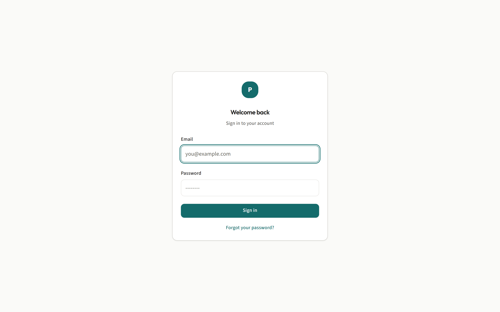
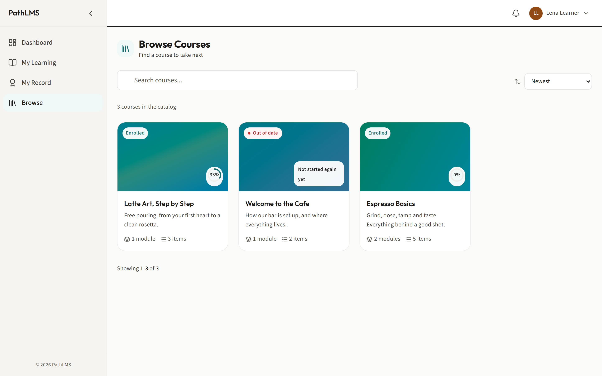
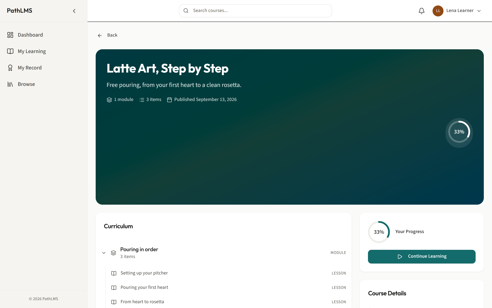
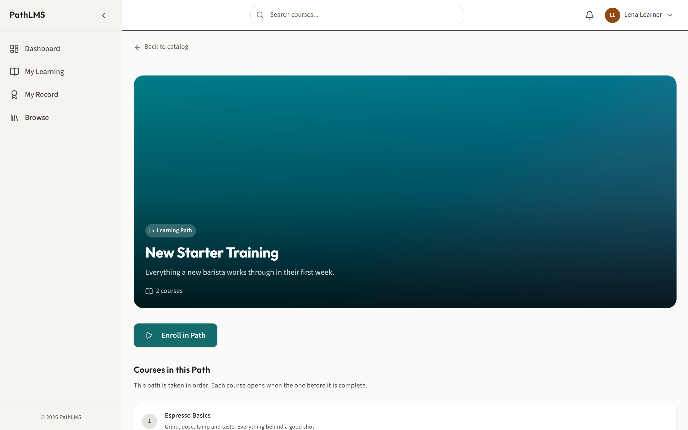
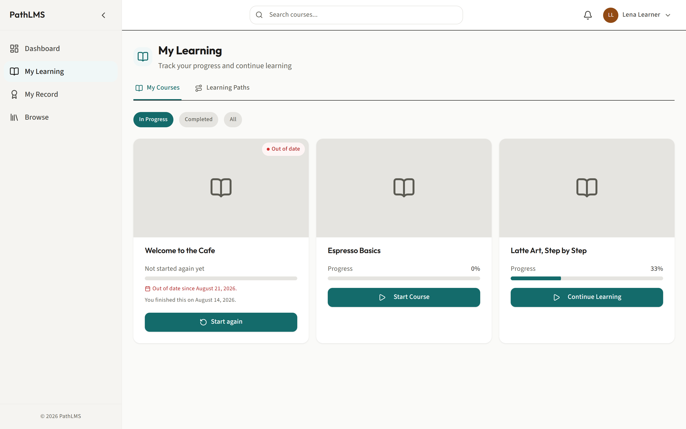
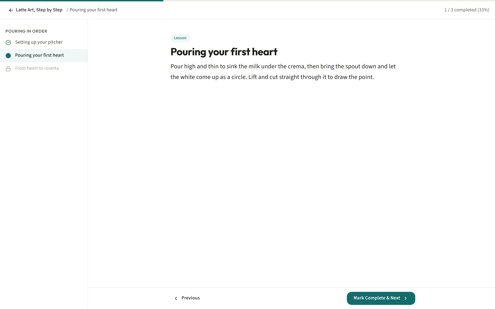
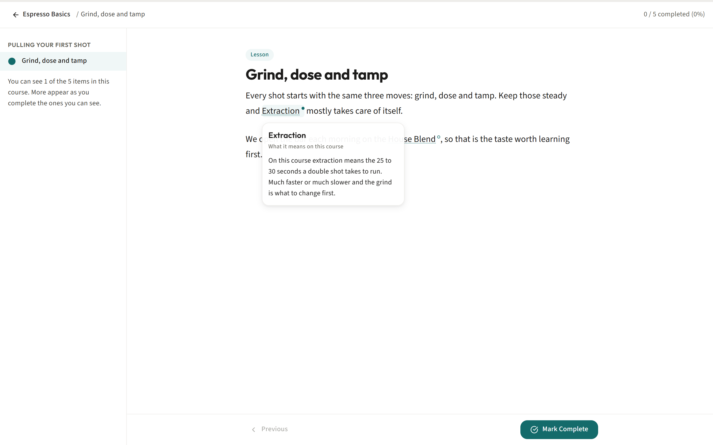
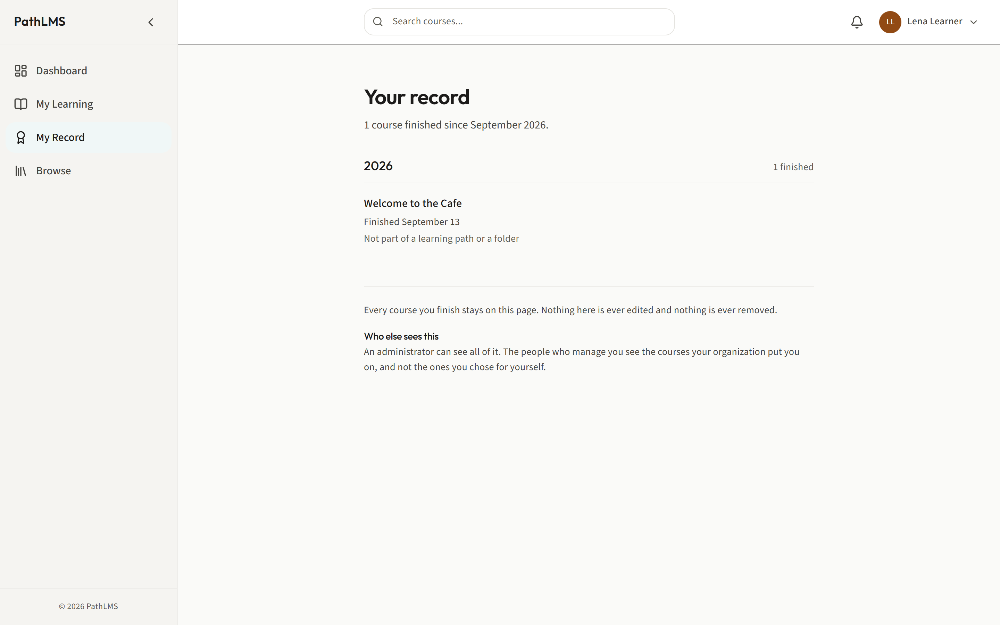
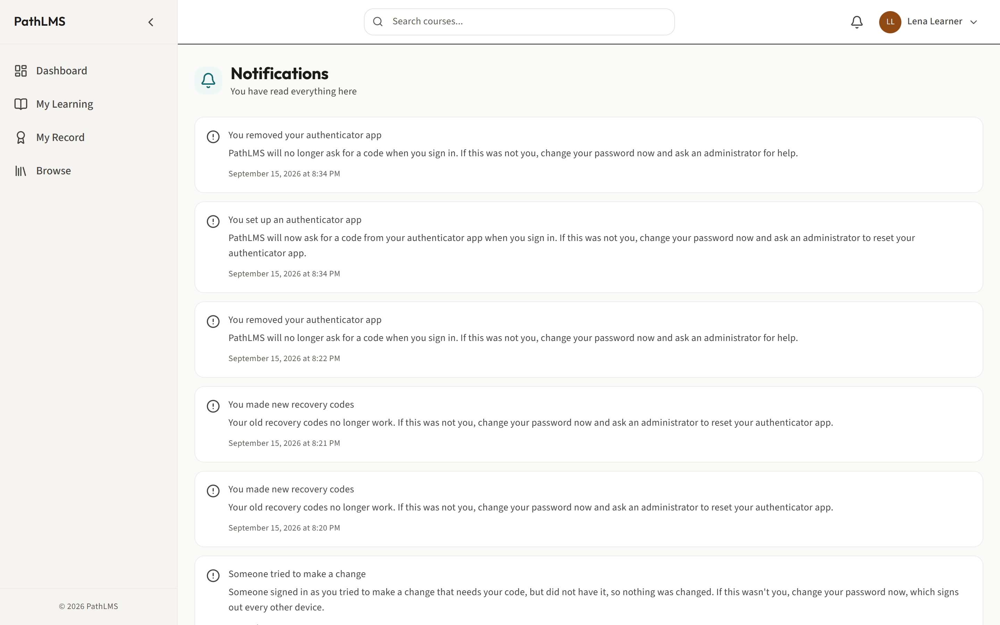
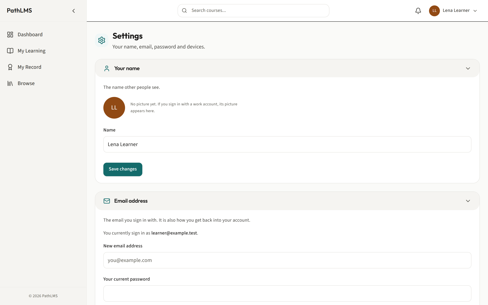

# The learner guide

This is for anyone taking training in PathLMS. You do not manage anyone else's
training here, only your own.

With this role you can:

- Find and enroll in a course, or a whole learning path.
- Work through a course, and pass its quizzes.
- Look up a word you do not know without leaving the lesson.
- See everything you have finished, and print a certificate.
- Keep required training up to date when it needs doing again.
- Manage your own account, your notifications and your signed-in devices.

## Signing in

Why: you need to be signed in before PathLMS will show you anything of your own.

1. Go to the sign-in page at `/login`.
2. Type your **Email** and **Password**, then press **Sign in**.
3. If your account uses an authenticator app as a second step, PathLMS asks for
   your code next: a six-digit number your phone's authenticator app shows
   you, which changes every 30 seconds. Type it and press **Sign in** again.
4. If you cannot get your code, and you were given ten recovery codes when the
   app was set up, use one of those instead of the six-digit code.

What happens: you land on your Dashboard, signed in.

If you have forgotten your password, press **Forgot your password?** on the
sign-in screen. Whether or not mail is set up for this deployment, the screen
tells you honestly what to do next: either a reset link is sent to you, or you
are told to ask your administrator for a new password.

Recommendation: if your account offers an authenticator app and you have not
set one up, do it. Go to **Settings**, find **Authenticator app**, and press
**Set up**. It is a five-minute job and it is the single best thing you can do
to keep your account secure. Keep the ten recovery codes somewhere safe and
separate from your phone: they are the only way in if you ever lose it.

---

## Finding a course to take

Why: before you can learn anything, you need to find it. Browse is the
catalogue of every course open to enrollment.

1. In the sidebar, click **Browse**. The address is `/browse`.
2. Type in the search box to narrow the list by title.
3. Use the sort dropdown to change the order: Newest, Oldest, Title A-Z, Title
   Z-A, or Recently Published.
4. Click a course card to open it.

What happens: you see every published course you are allowed to see. A course
somebody has deliberately hidden from the catalogue will not appear here, but
if you are already enrolled on it, it still runs for you exactly as before.
Being left off Browse only means nobody new can stumble onto it.

## Looking at a course before you join it

Why: you can read what a course covers, how big it is, and what you have to do,
before committing your time to it.

1. From Browse, or from a link somebody sent you, open a course. The address is
   `/courses/:courseId`.
2. Read the description and the curriculum, which lists every module and item
   in the order you will meet them.
3. Press **Enroll Now** to join.

What happens: you are enrolled, and PathLMS takes you straight into the course
to start it. If enrollment on a course is closed, the page tells you plainly and
points you to your administrator instead of leaving you guessing why nothing
happened.

## Joining a learning path

Why: some training is bigger than one course. A learning path is a set of
courses somebody has planned as one journey.

1. Open a learning path page, at `/paths/:pathId`.
2. Read the courses listed under **Courses in this Path**.
3. Press **Enroll in Path**.

What happens: you are enrolled in every course the path contains. If the path
says: "This path is taken in order. Each course opens when the one before it
is complete," each course only opens once you have finished the one before it,
and a locked course shows a padlock instead of letting you in early.

---

## Your list of courses: My Learning

Why: My Learning is where you go to pick up where you left off. Browse is for
finding new things; My Learning is for continuing what you already started.

1. In the sidebar, click **My Learning**. The address is `/my-courses`.
2. Switch between the **My Courses** and **Learning Paths** tabs at the top.
3. Use the **In Progress**, **Completed** and **All** pills to narrow the list.
4. Press **Continue Learning** on a card to carry on, or **Start Course** if you
   have not opened it yet. A finished course shows **Review Course** instead.

What happens: each card shows your real progress, drawn the same way everywhere
in PathLMS, so the percentage you see here always matches what the course page
and the catalogue say.

---

## Taking a course

Why: this is the actual work. Everything before this was about finding and
joining a course; this is where you go through it.

1. Press **Continue Learning** or **Start Course** to open the player, at
   `/course/:courseId`.
2. Read or work through the item on the right. Use the outline on the left to
   see everything the course contains and how far you have got.
3. When you are done with an item, press **Mark Complete**, or **Mark Complete &
   Next** to move straight on to the next item.
4. Use **Previous** and **Next** to move between items you have already opened.

What happens: your progress is saved as you go, and the outline on the left
ticks off each item as you finish it.

Two kinds of item behave differently, and it is worth knowing both before you
meet them:

- An uploaded course. This is a course made in another tool and brought in as
  a package. You will not see a Mark Complete button on it. Instead, PathLMS
  says plainly: "This one is ticked off when the course itself says you have
  finished it." Work through it as it presents itself, and it reports your
  finish for you.
- A quiz. You must pass it before your Mark Complete press is accepted. See the
  next section.

Recommendation: if a course lets you jump around, resist the urge to skip
straight to the end. The order was chosen by whoever built it, usually for a
reason, and skipping ahead is how people end up passing a quiz on a guess
rather than on what they actually learned.

## Taking a quiz

Why: a quiz is how a course checks that something actually landed, before it
lets you move on.

1. Open the quiz item. If it is your first attempt, press **Start Quiz**; if you
   are having another go, press **Retry Quiz**.
2. Answer each question. You will meet three kinds:
   - A question asking you to **Select one answer**: pick the single correct
     one.
   - A question asking you to **Select all that apply**: pick every correct
     one, there may be more than one.
   - A true-or-false question: the same as picking one answer, between two
     options.
3. When you have answered everything, press **Submit Quiz**.

What happens: PathLMS marks it against the pass mark the author set. If you
meet it, the quiz is recorded as passed and your Mark Complete press on it will
now be accepted. If you do not, you are told your score and, if you have
attempts left, offered **Retry Quiz**. If you have used every attempt you were
given, the screen says so plainly rather than leaving you pressing a button
that will never work again.

Recommendation: read the question type instruction before you answer.
"Select all that apply" and "Select one answer" look similar at a glance, and
answering a multi-answer question as if it only wanted one is one of the most
common ways to fail a quiz you actually knew the answer to.

## Looking up a word you do not know

Why: some courses use words that are specific to the subject, and stopping to
look them up elsewhere breaks your concentration and loses your place.

1. While reading a lesson, look for a word with a dotted underline. That marks
   a glossary term.
2. Hover it, or move keyboard focus onto it, to see its meaning.

What happens: a small tooltip shows you what the word means, specifically for
the course you are reading. The same word can mean something different in
another course, so what you see here is always the meaning that applies to
what you are currently learning. There is no separate glossary page for you to
visit: the meaning comes to you, in the lesson, exactly when you need it.

---

## Your record and your certificates

Why: My Learning shows work in progress. Your record is different: it is a
permanent, honest account of everything you have ever finished, and it is
never edited or removed.

1. In the sidebar, click **My Record**. The address is `/my-record`.
2. Your finished courses are listed grouped by year, newest first, each with
   the date you finished it and what it counted toward.
3. Where a course awards one, press **Certificate** under that entry to open it.

4. On the certificate page, press **Print or save as PDF** to get a copy you
   can keep or hand to somebody who needs proof.

What happens: nothing on Your record is ever edited or removed, even if the
course itself is later changed or taken down. An administrator can see all of
it; the people who manage you can see the courses your organization put you
on, but not the ones you chose for yourself.

## When training repeats

Why: some training, safety courses especially, is set to expire so you have to
prove you still know it. PathLMS makes this visible rather than letting a
certificate quietly go stale.

1. When a course you finished before comes due again, it reappears on My
   Learning, not buried on Your record, because it is active work again.
2. If your last attempt time ran out before you finished it, the course offers
   a **Start again** button in place of the ordinary Continue button.
3. Press **Start again** to open a fresh attempt.

What happens: your earlier completions stay on Your record exactly as they
were. Starting again adds a new attempt; it never rewrites history.

---

## Notifications

Why: the bell icon in the header shows you a short list, but the full history
of everything PathLMS has told you lives on its own page.

1. In the sidebar, click **Notifications**. The address is `/notifications`.
2. Press **Mark as read** on a single notification, or **Mark all read** to
   clear everything at once.

What happens: simply opening this page is treated as reading what it shows, so
the unread count on the bell clears the moment you look at it, the same way it
would if you read every message individually.

## Managing your account and your devices

Why: your name, your password, and which devices are currently signed in as
you are all things you are entitled to see and control yourself.

1. In the sidebar, click **Settings**.
2. Update your name, email or password in their own sections.
3. To see and manage your signed-in devices, go to **Settings**, then
   **Devices**, or directly to `/settings/sessions`, headed "Devices you are
   signed in on".

What happens: you can end a session on any device that is not the one you are
using, which is the right thing to do if you ever sign in somewhere you should
not have, or simply lose track of a device you signed in on once.

Recommendation: check your devices list occasionally, the same way you would
check which apps have access to your email. It costs nothing and it is the
easiest way to notice a sign-in you do not recognize.

---

Related guides: [courses, folders and learning paths](courses-folders-and-paths.md)
for how the training you are given fits together, and [the glossary](glossary.md)
for more on how the words inside a course get their meanings.
