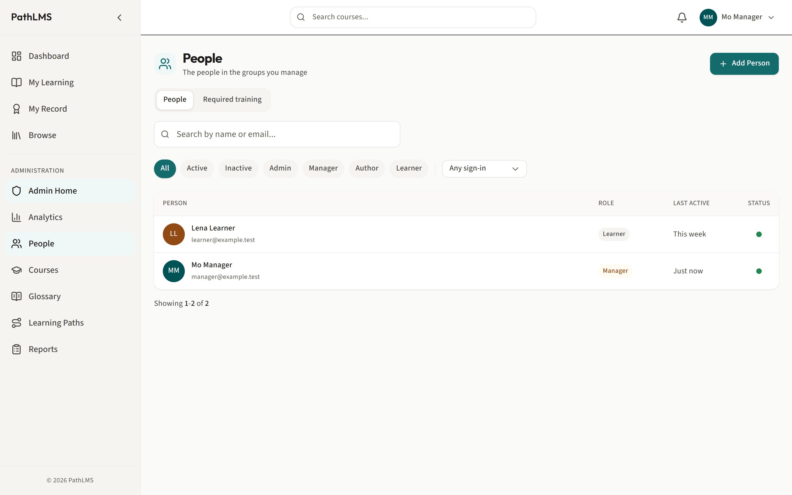
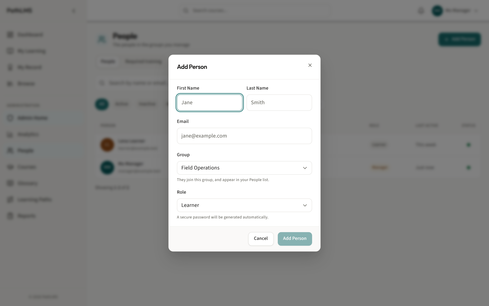
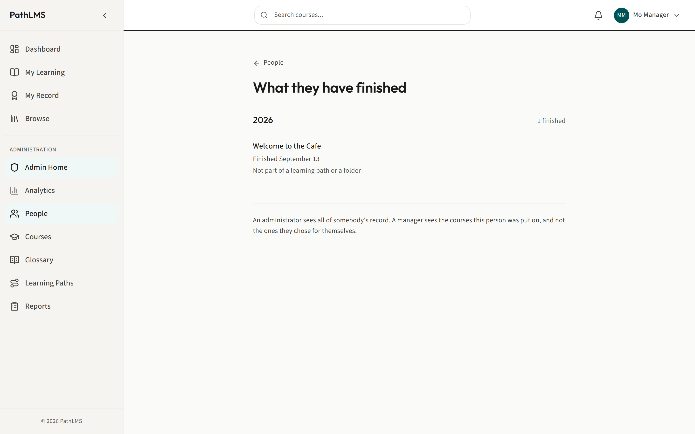
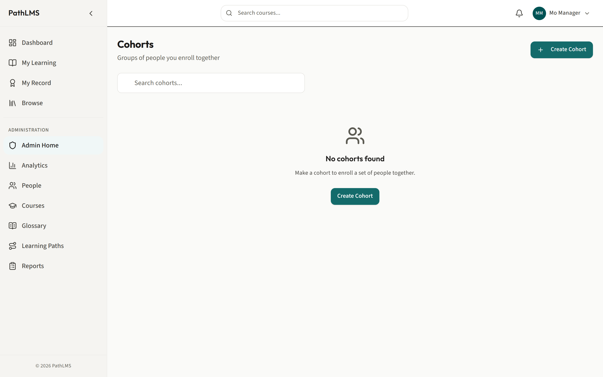
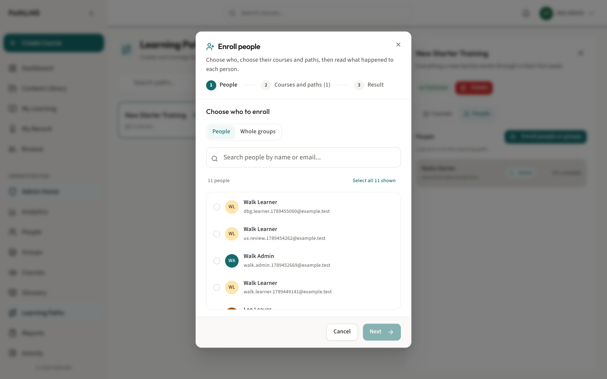
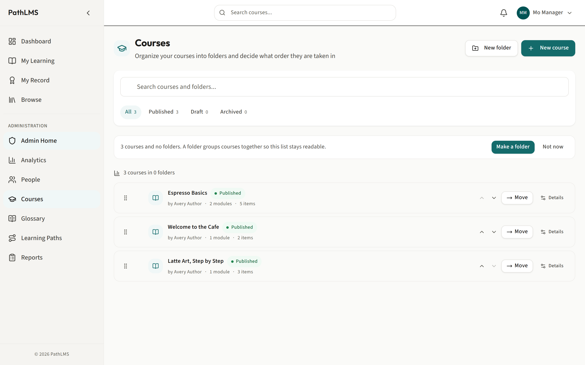
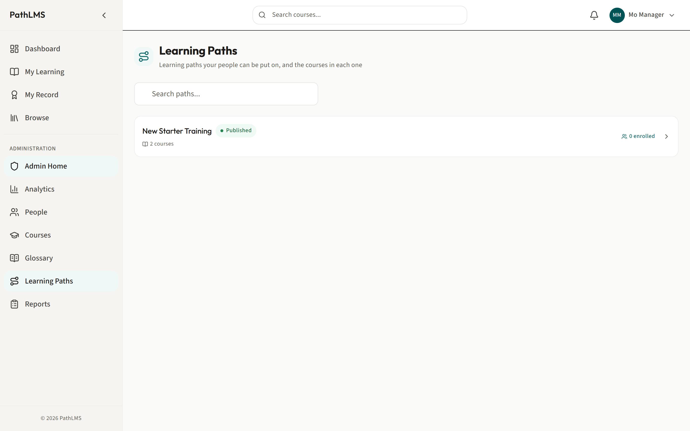
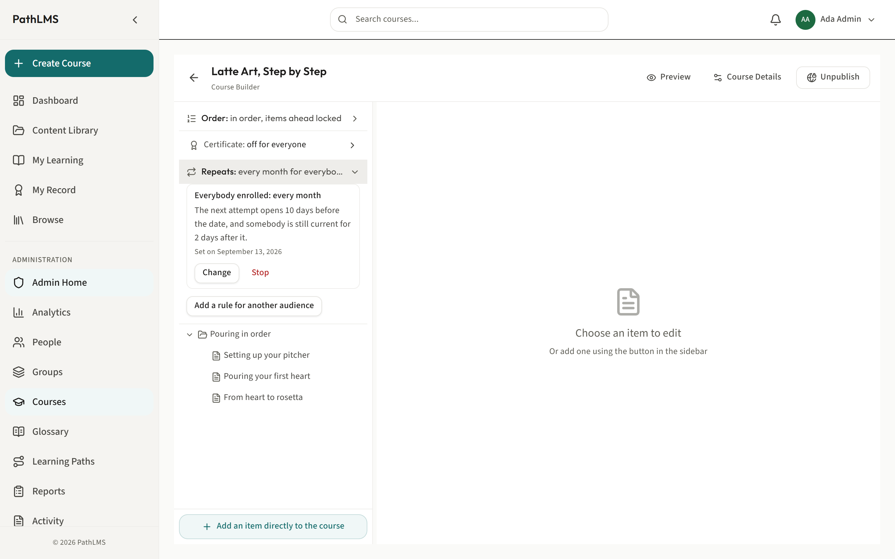
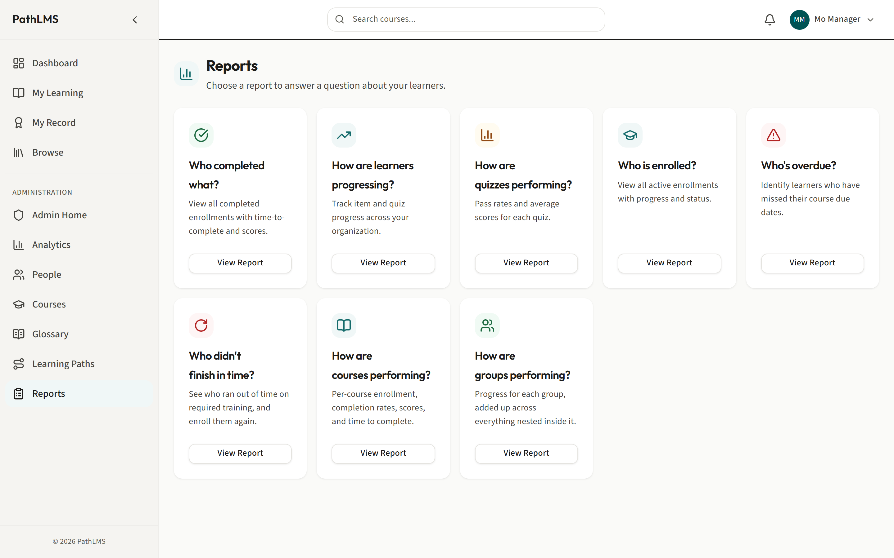
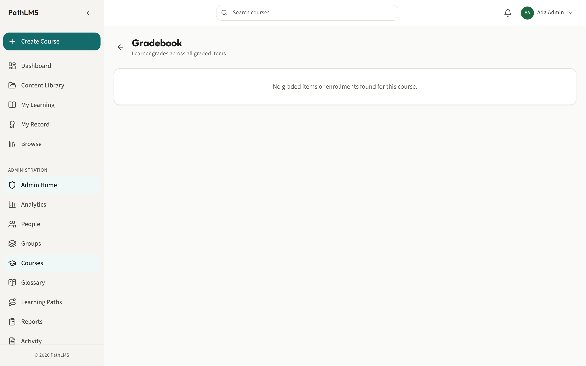

# The manager guide

This is for a manager. You look after people and get training to them, for
the groups you run. You do not set up the groups themselves, and you do not
touch anyone's password or role: an administrator does that.

With this role you can:

- Find the people in your groups and see what they have finished.
- Enroll people, or a whole group at once, on a course or a learning path.
- Read who is on track and who is behind, for your groups.
- Build and reorder folders of courses, the same as an author.
- Set a course to repeat for your own groups.
- Add a new person to one of your groups.

## Finding your people

Why: before you can enroll anyone or check on their training, you need to
find them. The People screen is your directory, but it only ever shows you
the groups you actually run. You will never see the whole company here
unless you manage all of it.

1. In the sidebar, click **People**.
2. Use the search box to find someone by name or email.
3. Click a filter pill, such as **Active** or **Learner**, to narrow the list.
4. Click a row to open that person's detail panel, which slides out from the
   right.

What happens: the list and the panel only ever hold people from the groups
you run. A manager and an administrator looking at the same directory will
not see the same list, and that is by design.

A note on what you cannot do here. You cannot change anyone's role, reset a
password, or turn an account on or off. Those controls belong to an
administrator, and you will not see them on this screen. What you can do is
add a brand new person to one of your own groups, covered next.

### Adding a new person to your group

Why: when someone new joins a team you run, they need an account before you
can enroll them on anything. Adding them here puts them straight into your
group, so they show up in your People list right away.

1. On the People screen, click **Add Person**.
2. Fill in their first name, last name and email address.
3. Choose the **Group** they join. If you only run one group, this is
   filled in for you.
4. Choose their **Role**: Learner or Author. You cannot make someone a
   Manager here, only an administrator can do that.
5. Click **Add Person**.

What happens: a password is generated for them automatically and shown to
you once, so you can pass it on. They appear in your People list straight
away, in the group you chose.

Recommendation: always check the group before you save. The People list is
built entirely from group membership, so someone added without a group
would not show up anywhere on your screen, and you would think the save
had failed.

## Checking one person's training

Why: before you chase someone about a course, or tell someone else they are
up to date, check their actual record. It separates what they were told to
do from what they picked for themselves, and it shows you any standing
requirements they are falling behind on.

1. From the People screen, open someone's detail panel and click **See
   [their name]'s record**. This takes you to a page titled **What they
   have finished**.
2. Read down the list, grouped by year, to see what they have completed.
3. Look at the **Required training** section for a line per standing
   requirement, marked current, due again, or out of date.

What happens: you see only the training this person was put on by someone
else, not courses they chose for themselves out of personal interest. That
line is shown to every reader, always, whether or not anything is actually
being held back, so its presence tells you nothing about whether something
is hidden.

## Groups and cohorts

Why: it helps to know what a group and a cohort actually are, even though
setting them up is not your job.

A group is set up by an administrator, on the Groups screen, which is not
something you can reach. If you need a new group, or need to be granted one
you do not already run, ask an administrator.

A cohort is a smaller named set of people inside a group, with its own
manager. You can reach the Cohorts screen by typing `/admin/cohorts` into
the address bar, but be aware: there is no menu entry for it today, on
either an administrator's or a manager's sidebar. If you use cohorts, you
will need to bookmark the address or navigate there directly each time.

Recommendation: if a whole group is really one team, keep it as a group.
Use a cohort only when you need a smaller, named slice of a group with its
own manager, since it is easy to lose track of a screen with no link to it.

## Enrolling people or groups on a learning path

Why: this is the fastest way to get a set of courses in front of the right
people. Instead of adding one person at a time, you put a whole group on a
learning path in one action, and the dialog tells you plainly if anyone could
not be added.

1. Open the learning path you want to put people on, and switch to its
   **People** side.
2. Click **Enroll people or groups**.
3. Choose the **People** tab to pick individuals, or the **Whole groups**
   tab to pick one of your groups.
4. Confirm the enrollment.

What happens: everyone you chose is enrolled in every course the path holds. If
anyone could not be, the dialog tells you exactly who and why, such as an
inactive account, a suspended account, or someone already enrolled. It never
just quietly skips someone and calls it done.

Two other ways to get courses to a group. Open the folder the courses live in
and use **Who is on this folder**, which puts the group on everything in it and
keeps them in step as you add more (see [courses, folders and learning
paths](courses-folders-and-paths.md)). Enrolling people onto a single course on
its own is an administrator's job.

Recommendation: for a whole team, enroll the group rather than picking people
out one at a time. Anyone who joins the group later still needs enrolling
separately, so check back after adding new people.

## Building folders of courses

Why: as your course library grows, a flat list becomes hard to work with.
Folders let you group related courses together and put them in the order
you want people to see them.

1. In the sidebar, click **Courses**.
2. Make new folders, drag courses into them, and reorder items as needed.

What happens: you get the same screen an author uses. For the full detail
on how folders, courses and learning paths fit together, see
[Courses, folders and learning paths](courses-folders-and-paths.md).

## Reading who is on a learning path

Why: a learning path bundles several courses into one track. Your half of
that screen is the roster: enrolling people or groups on the path, and
seeing who is on it, for your own groups. Building the path itself is an
author's job.

1. In the sidebar, click **Learning Paths**.
2. Open a path to see its roster, narrowed to the people in the groups you
   run.
3. Use **Enroll people or groups** on the path the same way you would on a
   course.

What happens: you see progress for your own people only. You cannot
create or edit the path itself, only enroll people on it and check on
them. See [Courses, folders and learning paths](courses-folders-and-paths.md)
for how a path is put together.

## Setting training to repeat

Why: some training needs to be done again on a schedule, such as once a
year. Rather than re-enrolling everyone by hand each time, you can set the
course to repeat, and the product does it for you.

1. Open the course in the Course Builder.
2. In the left outline panel, find the row that reads **Repeats:** followed
   by a summary such as "no" or "every year for everybody enrolled".
3. Click it to expand the panel, and add a rule.
4. Choose one of your own groups as the audience. You cannot choose
   "everybody enrolled": that choice only appears for an administrator.
5. Set how often it repeats, then save.

What happens: the row updates to describe the new rule, for example
"Repeats: every year for everybody enrolled and 2 groups". People in that
group are automatically put back on the course when it comes due again.

## Reports and the gradebook

Why: reports tell you at a glance who has finished what, who is overdue,
and how a course is performing, without you having to open every person's
record one at a time.

1. In the sidebar, click **Reports** for an overview, or open **Group
   rollup** for a per-group breakdown.
2. Filter to the group or course you care about.
3. Click **Export** and choose **CSV**, **Excel (.xlsx)** or **PDF** if you
   want a copy to share.

What happens: you get completion rates and overdue lists for your own
groups. Names and email addresses are left out of the export unless you
tick the box to include them, so check that box only when you actually
need to hand over personal information.

For a single course, open its **Gradebook** to see students as rows and
graded items as columns.

Recommendation: reach for Group rollup when you are answering "how is my
team doing", and reach for a single course's Gradebook when you are
answering "how did this person do on this quiz".

## Related guides

- [Courses, folders and learning paths](courses-folders-and-paths.md), for
  how the pieces you enroll people on fit together.
- [The administrator guide](administrator.md), for what an administrator
  can do that you cannot, such as changing roles and resetting passwords.
- [The glossary](glossary.md), for giving a word the right meaning inside a
  course.
